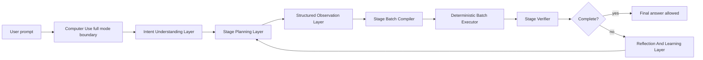

# Universal Computer Use Layered Skills And Prompt Accuracy Implementation Plan

> **For agentic workers:** REQUIRED SUB-SKILL: Use superpowers:subagent-driven-development (recommended) or superpowers:executing-plans to implement this plan task-by-task. Steps use checkbox (`- [ ]`) syntax for tracking.

**Goal:** Upgrade OpenHarness Computer Use from a fallback-heavy desktop loop into a universal, layered, accuracy-first Computer Use runtime that improves intent understanding, task planning, observation, batch execution, verification, and reflection without changing the global agent prompt.

**Architecture:** Keep ClaudeCode-style runtime governance as the lower safety layer: permission, lock, target ownership, tool scope, desktop executor, cleanup, and harness-style task context. Before implementation, map ClaudeCode's harness patterns for agent context, tool-use loop, subtask state, result feedback, failure convergence, and cleanup into an OpenHarness Computer Use internal runtime. Add OpenHarness-specific internal layer skills/prompts under `learning_agent/computer_use_mcp_v2/layer_skills/`, then wire them only into Computer Use full mode and the `desktop_task` high-level tool path. Execution remains deterministic and target-bound; prompt guidance is used for understanding, planning, observation interpretation, verification, and reflection, not for unbounded low-level action dispatch.

**Tech Stack:** Python 3.11+, pytest, OpenHarness `learning_agent.computer_use_mcp_v2`, existing `UniversalStageTaskLoop`, existing `ActionBatch`/target lease/FreshTarget code, existing visible-terminal acceptance controller, CodeGraph.

---

## 1. Why This Plan Exists

The current bug pattern shows the wrong engineering center of gravity:

- The runtime can sometimes open applications and dispatch real mouse or keyboard events.
- The runtime has target lease, final gate, and `desktop_task_incomplete` safety fuses.
- But complex desktop tasks still fail because the main path is not accurate enough.
- When the model fails once, pure retry often repeats the same bad action.
- A final gate can prevent false success, but it cannot make the task complete.

This plan changes the product direction from "failure recovery first" to "main-path accuracy first":

1. Understand the user's desktop intent accurately.
2. Convert the intent into generic, staged work units.
3. Observe the target window as structured facts, not just screenshots and raw text.
4. Compile each stage into one bounded batch of actions.
5. Verify stage completion with evidence.
6. Reflect only when a stage actually fails, and feed the reflection into the next attempt.

The final gate remains, but only as a safety fuse.

## 2. Hard Product Boundaries

This is a universal Computer Use plan.

The implementation must not become a Notepad automation, Paint automation, browser automation, WeChat automation, WPS automation, or any other single-app automation project.

Application names may appear in:

- Representative acceptance scenarios.
- Launch aliases and app discovery metadata.
- Sanitized evidence fields.
- Unit-test prompts that prove generic behavior.

Application names must not drive core behavior in the new layers. Core behavior must be based on:

- target window identity,
- observed capabilities,
- editable/canvas/menu/dialog facts,
- task kind,
- stage kind,
- target-bound action batches,
- verifier evidence.

## 3. User Requirement About Isolation

All new layer skill or prompt files must live inside:

`H:\codexworkplace\sofeware\OpenHarness-main\learning_agent\computer_use_mcp_v2`

Recommended root:

`H:\codexworkplace\sofeware\OpenHarness-main\learning_agent\computer_use_mcp_v2\layer_skills`

These files must not be placed in:

- `H:\codexworkplace\sofeware\OpenHarness-main\learning_agent\skills`
- `H:\codexworkplace\sofeware\OpenHarness-main\skills`
- global Codex skill directories
- global agent system prompt files
- project-wide `dynamicprompt.md`

Reason:

- The work is only for OpenHarness Computer Use.
- Other agent capabilities must not inherit Computer Use-specific prompt rules.
- Long tasks are less likely to drift when each Computer Use layer owns its own small prompt.

## 4. ClaudeCode-Inspired Principle

ClaudeCode's useful idea is not "hardcode every application."

The useful idea is separation of concerns:

- wrapper/session context decides whether Computer Use is active,
- permission controls which apps can be operated,
- lock prevents multiple sessions controlling the desktop,
- executor centralizes screenshots and desktop actions,
- cleanup releases the session state,
- app metadata is filtered before reaching the model.

OpenHarness should keep that lower-layer governance, then add an upper-layer desktop task brain:



The executor is deliberately not a free-reasoning layer.

### 4.1 ClaudeCode Harness Reference Scope

The next implementation must study ClaudeCode's harness design before changing OpenHarness Computer Use runtime code.

The goal is not to port ClaudeCode source code line by line. The goal is to learn how ClaudeCode keeps long-running agent work controlled, stateful, interruptible, observable, and recoverable.

ClaudeCode harness areas to study:

- `D:\ClaudeCode-main\ClaudeCode-main\utils\agentContext.ts`
- `D:\ClaudeCode-main\ClaudeCode-main\tools\AgentTool\agentToolUtils.ts`
- `D:\ClaudeCode-main\ClaudeCode-main\tasks\LocalAgentTask\LocalAgentTask.tsx`
- `D:\ClaudeCode-main\ClaudeCode-main\tasks\InProcessTeammateTask`
- `D:\ClaudeCode-main\ClaudeCode-main\components\CoordinatorAgentStatus.tsx`
- `D:\ClaudeCode-main\ClaudeCode-main\utils\computerUse\wrapper.tsx`
- `D:\ClaudeCode-main\ClaudeCode-main\utils\computerUse\executor.ts`
- `D:\ClaudeCode-main\ClaudeCode-main\utils\computerUse\computerUseLock.ts`
- `D:\ClaudeCode-main\ClaudeCode-main\utils\computerUse\cleanup.ts`

Harness concepts to map into OpenHarness Computer Use:

- agent context and task-local context,
- tool-use context,
- tool result feedback into the next loop,
- subtask or teammate task state,
- permission state,
- abort and cleanup state,
- progress/status rendering,
- failure result propagation,
- retry or convergence boundaries,
- separation between orchestration and low-level execution.

### 4.2 OpenHarness Mapping From ClaudeCode Harness

OpenHarness Computer Use should become a dedicated desktop-task harness that borrows the control architecture from ClaudeCode and adds desktop-specific semantics.

ClaudeCode concept to OpenHarness Computer Use mapping:

| ClaudeCode concept | OpenHarness Computer Use mapping |
| --- | --- |
| agent context | `ComputerUseTaskContext` scoped to one desktop task |
| tool-use context | `ComputerUseToolUseContext` scoped to one desktop action or batch |
| subagent/local task state | `DesktopTaskRunState` plus ordered `StageResult` records |
| tool result feedback | observation facts, action results, verifier result, and reflection result fed into the next stage |
| permission state | `/computer use --full`, request access, allowed target apps, and explicit existing-window grants |
| lock | one active real desktop Computer Use session at a time |
| cleanup | release lock, target lease, pending actionability, and temporary secure text channels |
| task progress UI | structured stage progress returned in `desktop_task` evidence and acceptance logs |
| failure propagation | `failure_class`, `missing_requirements`, `repair_strategy`, and `desktop_task_incomplete` |
| executor | deterministic `ActionBatch` runner over screenshots, windows, mouse, keyboard, clipboard, and app launch |

The harness lesson is:

- ClaudeCode teaches how to keep a task controlled.
- OpenHarness must teach the controlled task how to operate a real desktop.

Therefore, the implementation order must be:

1. Learn and document ClaudeCode harness mechanisms.
2. Define OpenHarness Computer Use internal task context and loop state.
3. Add internal layer skills/prompts.
4. Wire intent, planning, observation, execution, verification, reflection, and learning into the Computer Use task harness.

## 5. Layer Design

### 5.1 Intent Understanding Layer

Purpose:

- Extract what software or resource the user wants to control.
- Extract the desired outcome.
- Extract required artifacts, filenames, locations, content, visual requirements, and success criteria.
- Detect multi-app tasks.
- Detect whether user explicitly allowed using an already-open window.
- Detect safety-sensitive operations.

Output:

- `IntentUnderstandingResult`
- no low-level mouse or keyboard actions
- no app-specific script

Example generic fields:

- `objective`
- `task_kind`
- `target_app_hints`
- `required_targets`
- `content_payloads`
- `artifact_requests`
- `success_criteria`
- `requires_fresh_resource`
- `allows_existing_user_window`
- `risk_level`
- `needs_clarification`

### 5.2 Stage Planning Layer

Purpose:

- Convert the understood intent into stable stages.
- Avoid one primitive action per reasoning turn.
- Decide where stage-boundary observation is required.
- Represent multiple applications as separate target refs and stage ownership.

Generic stage kinds:

- `prepare_target`
- `probe_capabilities`
- `prepare_resource`
- `perform_text_work`
- `perform_canvas_work`
- `perform_form_work`
- `perform_navigation_work`
- `perform_menu_work`
- `commit_resource`
- `verify_result`
- `cleanup_or_restore`

The planner must not output raw coordinates. It outputs stage goals and batch intents.

### 5.3 Structured Observation Layer

Purpose:

- Convert screenshot, UIA tree, active window, window inventory, dialogs, cursor state, and target lease into structured facts.
- Observe at stage boundaries, not after every small action.
- Give the planner and verifier facts they can use without rereading raw screenshots every turn.

Generic observation facts:

- `active_target_ref`
- `target_identity_verified`
- `target_window_freshness`
- `editable_regions`
- `canvas_regions`
- `menu_regions`
- `toolbar_regions`
- `modal_dialogs`
- `save_dialog_state`
- `document_dirty_state`
- `visible_text_summary`
- `visual_change_summary`
- `capability_profile`

### 5.4 Stage Batch Compiler

Purpose:

- Turn a `StagePlan` plus `ObservationFacts` into one `ActionBatch`.
- Use capability facts, not app names.
- Keep all actions in the batch bound to one `target_ref`.
- Create larger batches for speed, while still enforcing bounds.

Batch examples:

- text entry batch: focus editable region, select content if needed, type secure text, observe once after stage.
- canvas batch: focus canvas, draw planned path group, apply color/fill sequence, observe once after stage.
- form batch: focus each field and type values in one bounded batch.
- save batch: invoke save path through generic shortcuts/menu/dialog handling, then verify artifact.

### 5.5 Deterministic Batch Executor

Purpose:

- Execute only validated batches.
- Refuse batches without `target_ref`.
- Refuse batches if the focused window drifts.
- Refuse batches if low-level event count exceeds stage limits.
- Never ask a prompt to decide arbitrary next low-level action.

This layer may have a `CONTRACT.md`, but it should not have a free-form LLM prompt.

### 5.6 Stage Verifier

Purpose:

- Decide whether each stage is complete based on evidence.
- Use task-specific success criteria from structured intent.
- For file save tasks, verify file existence and application-visible save state when possible.
- For text tasks, verify content by observation or controlled read where safe.
- For drawing tasks, verify visual evidence such as nonblank canvas, color diversity, and shape coverage.

Output:

- `StageVerificationResult`
- `verified`
- `missing_requirements`
- `next_required_stage`
- `needs_reflection`
- `needs_user`

### 5.7 Reflection And Learning Layer

Purpose:

- Run only after verified failure.
- Explain why the stage failed in structured terms.
- Produce a revised plan or revised batch constraints.
- Store sanitized reusable lessons only when the same failure class repeats.

It must not store raw screenshots, secrets, exact private document text, or full user prompts.

Reflection output examples:

- `failure_class=wrong_region`
- `failure_class=target_drift`
- `failure_class=batch_too_small`
- `failure_class=save_dialog_unhandled`
- `repair_strategy=reobserve_and_recompile_batch`
- `repair_strategy=request_user_close_existing_single_instance_app`

## 6. Proposed File Structure

Create internal layer skill and prompt files:

```text
learning_agent/computer_use_mcp_v2/layer_skills/
  README.md
  intent_understanding/
    SKILL.md
    OUTPUT_SCHEMA.md
  stage_planning/
    SKILL.md
    OUTPUT_SCHEMA.md
  observation/
    SKILL.md
    OUTPUT_SCHEMA.md
  verification/
    SKILL.md
    OUTPUT_SCHEMA.md
  reflection_learning/
    SKILL.md
    OUTPUT_SCHEMA.md
  batch_execution/
    CONTRACT.md
```

Create or modify runtime files:

```text
learning_agent/computer_use_mcp_v2/harness_research/README.md
learning_agent/computer_use_mcp_v2/harness_research/claudecode_harness_mapping.md
learning_agent/computer_use_mcp_v2/windows_runtime/harness_context.py
learning_agent/computer_use_mcp_v2/windows_runtime/layer_skill_loader.py
learning_agent/computer_use_mcp_v2/windows_runtime/layer_contracts.py
learning_agent/computer_use_mcp_v2/windows_runtime/intent_understanding_layer.py
learning_agent/computer_use_mcp_v2/windows_runtime/observation_fact_layer.py
learning_agent/computer_use_mcp_v2/windows_runtime/reflection_learning_layer.py
learning_agent/computer_use_mcp_v2/windows_runtime/stage_planner.py
learning_agent/computer_use_mcp_v2/windows_runtime/stage_batch_compiler.py
learning_agent/computer_use_mcp_v2/windows_runtime/stage_verifier.py
learning_agent/computer_use_mcp_v2/windows_runtime/stage_task_loop.py
learning_agent/computer_use_mcp_v2/windows_runtime/desktop_task_runtime.py
learning_agent/computer_use_mcp_v2/inferred_ant_mcp/build_tools.py
learning_agent/core/actionability_state.py
learning_agent/core/agent.py
```

Create tests:

```text
learning_agent/tests/test_computer_use_harness_context.py
learning_agent/tests/test_computer_use_layer_skill_loader.py
learning_agent/tests/test_computer_use_layer_contracts.py
learning_agent/tests/test_computer_use_intent_understanding_layer.py
learning_agent/tests/test_computer_use_observation_fact_layer.py
learning_agent/tests/test_computer_use_stage_planner_layered.py
learning_agent/tests/test_computer_use_stage_batch_compiler_layered.py
learning_agent/tests/test_computer_use_stage_verifier_layered.py
learning_agent/tests/test_computer_use_reflection_learning_layer.py
learning_agent/tests/test_computer_use_layered_desktop_task_loop.py
```

Create acceptance scenarios:

```text
learning_agent/acceptance_controller/scenarios/computer_use_layered_text_task_visible_terminal.json
learning_agent/acceptance_controller/scenarios/computer_use_layered_drawing_task_visible_terminal.json
learning_agent/acceptance_controller/scenarios/computer_use_layered_multi_app_task_visible_terminal.json
```

## 7. Implementation Tasks

### Task 0: Study ClaudeCode Harness And Map It To OpenHarness Computer Use

**Files:**

- Create: `learning_agent/computer_use_mcp_v2/harness_research/README.md`
- Create: `learning_agent/computer_use_mcp_v2/harness_research/claudecode_harness_mapping.md`
- Create: `learning_agent/computer_use_mcp_v2/windows_runtime/harness_context.py`
- Test: `learning_agent/tests/test_computer_use_harness_context.py`

- [ ] **Step 1: Use CodeGraph to inspect ClaudeCode harness paths**

Run:

```powershell
codegraph explore -p "D:\ClaudeCode-main\ClaudeCode-main" "agentContext AgentTool LocalAgentTask InProcessTeammateTask computerUse wrapper executor lock cleanup task state tool result feedback"
```

Expected:

```text
CodeGraph returns source and call relationships for ClaudeCode agent context, task state, tool result, and Computer Use wrapper/executor/cleanup paths.
```

- [ ] **Step 2: Write the harness mapping document**

Create `learning_agent/computer_use_mcp_v2/harness_research/claudecode_harness_mapping.md` with these sections:

```markdown
# ClaudeCode Harness To OpenHarness Computer Use Mapping

## Studied ClaudeCode Paths

- `utils/agentContext.ts`
- `tools/AgentTool/agentToolUtils.ts`
- `tasks/LocalAgentTask/LocalAgentTask.tsx`
- `tasks/InProcessTeammateTask`
- `utils/computerUse/wrapper.tsx`
- `utils/computerUse/executor.ts`
- `utils/computerUse/computerUseLock.ts`
- `utils/computerUse/cleanup.ts`

## Borrowed Harness Ideas

- task-local context
- tool-use context
- permission state
- lock and cleanup
- tool result feedback
- task progress state
- failure result propagation
- abort boundary

## OpenHarness Computer Use Mapping

- `ComputerUseTaskContext` owns one desktop task.
- `DesktopTaskRunState` owns ordered stages and stage results.
- `ComputerUseToolUseContext` owns one action batch.
- `ObservationFacts` feed the next planner or verifier step.
- `ReflectionLearningResult` feeds bounded repair.
- `ActionBatch` remains deterministic and target-bound.

## Non-Portable ClaudeCode Ideas

- Code-task-specific assumptions are not copied.
- UI rendering details are not copied into Computer Use runtime.
- Desktop-specific window identity and screenshot/UIA facts are implemented by OpenHarness.
```

- [ ] **Step 3: Write failing context contract tests**

Create `learning_agent/tests/test_computer_use_harness_context.py` with tests asserting:

- a task context has a stable `task_id`,
- a task context records current `stage_id`,
- a task context records allowed target refs,
- a task context records permission state,
- a task context records verifier state,
- a task context records reflection state,
- context JSON does not include raw screenshots or raw private text,
- context refuses a write batch without target ref.

- [ ] **Step 4: Implement minimal harness context**

Create `learning_agent/computer_use_mcp_v2/windows_runtime/harness_context.py`.

The file must define:

- `ComputerUseTaskContext`
- `ComputerUseToolUseContext`
- `ComputerUsePermissionState`
- `ComputerUseHarnessSnapshot`
- JSON helper methods compatible with existing stage runtime evidence.

- [ ] **Step 5: Run focused harness context tests**

Run:

```powershell
python -m pytest learning_agent/tests/test_computer_use_harness_context.py -q
```

Expected:

```text
passed
```

- [ ] **Step 6: Copy new and modified files to `learning_agent/test`**

Copy:

- `learning_agent/computer_use_mcp_v2/harness_research/README.md`
- `learning_agent/computer_use_mcp_v2/harness_research/claudecode_harness_mapping.md`
- `learning_agent/computer_use_mcp_v2/windows_runtime/harness_context.py`
- `learning_agent/tests/test_computer_use_harness_context.py`

### Task 1: Add Internal Layer Skill Files

**Files:**

- Create: `learning_agent/computer_use_mcp_v2/layer_skills/README.md`
- Create: `learning_agent/computer_use_mcp_v2/layer_skills/intent_understanding/SKILL.md`
- Create: `learning_agent/computer_use_mcp_v2/layer_skills/intent_understanding/OUTPUT_SCHEMA.md`
- Create: `learning_agent/computer_use_mcp_v2/layer_skills/stage_planning/SKILL.md`
- Create: `learning_agent/computer_use_mcp_v2/layer_skills/stage_planning/OUTPUT_SCHEMA.md`
- Create: `learning_agent/computer_use_mcp_v2/layer_skills/observation/SKILL.md`
- Create: `learning_agent/computer_use_mcp_v2/layer_skills/observation/OUTPUT_SCHEMA.md`
- Create: `learning_agent/computer_use_mcp_v2/layer_skills/verification/SKILL.md`
- Create: `learning_agent/computer_use_mcp_v2/layer_skills/verification/OUTPUT_SCHEMA.md`
- Create: `learning_agent/computer_use_mcp_v2/layer_skills/reflection_learning/SKILL.md`
- Create: `learning_agent/computer_use_mcp_v2/layer_skills/reflection_learning/OUTPUT_SCHEMA.md`
- Create: `learning_agent/computer_use_mcp_v2/layer_skills/batch_execution/CONTRACT.md`

- [ ] **Step 1: Write the internal README**

The README must state that these are Computer Use internal layer skills only, not global agent skills.

- [ ] **Step 2: Write the intent understanding skill**

The skill must instruct the model to extract structured desktop intent and success criteria, not to plan low-level actions.

- [ ] **Step 3: Write the stage planning skill**

The skill must instruct the model to produce generic stages over capabilities and task kinds, not application-specific scripts.

- [ ] **Step 4: Write the observation skill**

The skill must instruct the observation interpreter to produce facts such as editable regions, canvas regions, dialogs, and target identity.

- [ ] **Step 5: Write the verification skill**

The skill must instruct the verifier to compare observed facts against success criteria and return missing requirements.

- [ ] **Step 6: Write the reflection skill**

The skill must instruct reflection to classify failures and propose repair strategy without repeating the same failed action.

- [ ] **Step 7: Write the batch execution contract**

The contract must state that the executor is deterministic, target-bound, and does not use free-form model reasoning.

- [ ] **Step 8: Copy all new prompt/skill files to `learning_agent/test`**

This project rule keeps a learning copy of new files for review.

### Task 2: Add A Safe Internal Layer Skill Loader

**Files:**

- Create: `learning_agent/computer_use_mcp_v2/windows_runtime/layer_skill_loader.py`
- Test: `learning_agent/tests/test_computer_use_layer_skill_loader.py`

- [ ] **Step 1: Write failing tests**

Test cases:

- loader reads only from `learning_agent/computer_use_mcp_v2/layer_skills`,
- loader rejects `..` path traversal,
- loader rejects unknown layer names,
- loader truncates or refuses oversized prompt files,
- loader returns deterministic metadata: `layer_name`, `relative_path`, `content_sha256_16`, `content`.

- [ ] **Step 2: Implement the loader**

The loader must use a fixed allowlist:

- `intent_understanding`
- `stage_planning`
- `observation`
- `verification`
- `reflection_learning`
- `batch_execution`

It must not call the global `skill_load` runtime.

- [ ] **Step 3: Run focused tests**

Run:

```powershell
python -m pytest learning_agent/tests/test_computer_use_layer_skill_loader.py -q
```

Expected:

```text
passed
```

### Task 3: Define Layer Contracts

**Files:**

- Create: `learning_agent/computer_use_mcp_v2/windows_runtime/layer_contracts.py`
- Test: `learning_agent/tests/test_computer_use_layer_contracts.py`

- [ ] **Step 1: Write failing JSON round-trip tests**

The tests must cover:

- `IntentUnderstandingResult`
- `ObservationFacts`
- `StagePlanningResult`
- `StageVerificationResult`
- `ReflectionLearningResult`

- [ ] **Step 2: Add no-app-specific-core test**

The tests must assert that contract enum values do not contain `notepad`, `paint`, `mspaint`, `wechat`, `chrome`, `edge`, `wps`, or `word`.

- [ ] **Step 3: Implement contracts**

Contracts must be plain dataclasses or small typed helpers, compatible with existing JSON evidence style.

- [ ] **Step 4: Run focused tests**

Run:

```powershell
python -m pytest learning_agent/tests/test_computer_use_layer_contracts.py -q
```

Expected:

```text
passed
```

### Task 4: Build The Intent Understanding Layer

**Files:**

- Create: `learning_agent/computer_use_mcp_v2/windows_runtime/intent_understanding_layer.py`
- Modify: `learning_agent/computer_use_mcp_v2/windows_runtime/stage_planner.py`
- Test: `learning_agent/tests/test_computer_use_intent_understanding_layer.py`
- Test: `learning_agent/tests/test_universal_stage_planner.py`

- [ ] **Step 1: Write failing tests for representative prompts**

Prompts must include:

- text editor task,
- drawing task,
- browser or navigation task,
- multi-app task,
- unknown app task,
- single-instance app with no explicit existing-window grant,
- single-instance app with explicit existing-window grant.

- [ ] **Step 2: Implement deterministic extraction first**

The first implementation should use robust deterministic parsing for obvious fields: target hints, filenames, locations, quoted text, explicit grants, and risk words.

- [ ] **Step 3: Add internal skill prompt metadata to the result**

The layer should report which internal skill prompt version guided the extraction, but it must not leak prompt content into public final answers.

- [ ] **Step 4: Route StagePlanner through this layer**

`stage_planner.py` should consume `IntentUnderstandingResult` instead of re-parsing every prompt field independently.

- [ ] **Step 5: Run focused tests**

Run:

```powershell
python -m pytest learning_agent/tests/test_computer_use_intent_understanding_layer.py learning_agent/tests/test_universal_stage_planner.py -q
```

Expected:

```text
passed
```

### Task 5: Build Structured Observation Facts

**Files:**

- Create: `learning_agent/computer_use_mcp_v2/windows_runtime/observation_fact_layer.py`
- Modify: `learning_agent/computer_use_mcp_v2/windows_runtime/capability_profile.py`
- Modify: `learning_agent/computer_use_mcp_v2/windows_runtime/stage_task_loop.py`
- Test: `learning_agent/tests/test_computer_use_observation_fact_layer.py`
- Test: `learning_agent/tests/test_capability_profile.py`

- [ ] **Step 1: Write failing tests from synthetic observation frames**

Observation frames must cover:

- editable text region,
- canvas-like region,
- menu or toolbar region,
- save dialog,
- modal dialog,
- target drift,
- stale user-owned existing window,
- fresh agent-owned window.

- [ ] **Step 2: Implement fact extraction**

The layer must produce `ObservationFacts` from existing screenshot/UIA/window inventory evidence.

- [ ] **Step 3: Enforce stage-boundary observation policy**

`stage_task_loop.py` must observe according to `StagePlan.observation_policy`, not after every primitive action unless the stage is high-risk.

- [ ] **Step 4: Run focused tests**

Run:

```powershell
python -m pytest learning_agent/tests/test_computer_use_observation_fact_layer.py learning_agent/tests/test_capability_profile.py -q
```

Expected:

```text
passed
```

### Task 6: Upgrade Stage Planning To Use Intent Plus Facts

**Files:**

- Modify: `learning_agent/computer_use_mcp_v2/windows_runtime/stage_planner.py`
- Modify: `learning_agent/computer_use_mcp_v2/windows_runtime/stage_models.py`
- Test: `learning_agent/tests/test_computer_use_stage_planner_layered.py`
- Test: `learning_agent/tests/test_computer_use_multi_target_stage_loop.py`

- [ ] **Step 1: Write failing tests for stage quality**

The tests must assert:

- complex tasks produce multiple stages,
- each stage has one clear purpose,
- write stages require a target ref before execution,
- multi-app tasks produce explicit target ownership per stage,
- unknown app tasks start with capability probing,
- fresh resource requirement is represented generically.

- [ ] **Step 2: Add missing stage fields**

Add fields only if existing `StagePlan` cannot represent them:

- `input_contract`
- `output_contract`
- `observation_policy`
- `batch_intent`
- `verification_contract`
- `repair_policy`

- [ ] **Step 3: Remove product-path dependence on `WindowsPromptTaskPlanner` app branches**

Existing representative app branches may remain only for old contract tests or sample scenarios. The new full-mode `desktop_task` path must use the layered intent and stage planner.

- [ ] **Step 4: Run focused tests**

Run:

```powershell
python -m pytest learning_agent/tests/test_computer_use_stage_planner_layered.py learning_agent/tests/test_computer_use_multi_target_stage_loop.py -q
```

Expected:

```text
passed
```

### Task 7: Upgrade Stage Batch Compilation

**Files:**

- Modify: `learning_agent/computer_use_mcp_v2/windows_runtime/stage_batch_compiler.py`
- Modify: `learning_agent/computer_use_mcp_v2/windows_runtime/batch_executor.py`
- Test: `learning_agent/tests/test_computer_use_stage_batch_compiler_layered.py`
- Test: `learning_agent/tests/test_batch_executor.py`

- [ ] **Step 1: Write failing tests for batch size and target binding**

The tests must assert:

- text stage compiles into one text-entry batch,
- canvas stage compiles into grouped pointer paths,
- save stage compiles into one bounded commit batch,
- every write batch has exactly one `target_ref`,
- executor refuses target drift,
- executor refuses batches above configured event limits.

- [ ] **Step 2: Compile from facts instead of app names**

The compiler should use `ObservationFacts` and capability profile fields such as `has_text_input`, `has_canvas_like_region`, and `has_file_save_surface`.

- [ ] **Step 3: Keep low-level execution deterministic**

`batch_executor.py` must not read prompt files or call model reasoning. It only executes validated `ActionBatch` objects.

- [ ] **Step 4: Run focused tests**

Run:

```powershell
python -m pytest learning_agent/tests/test_computer_use_stage_batch_compiler_layered.py learning_agent/tests/test_batch_executor.py -q
```

Expected:

```text
passed
```

### Task 8: Upgrade Verification And Final Gate

**Files:**

- Modify: `learning_agent/computer_use_mcp_v2/windows_runtime/stage_verifier.py`
- Modify: `learning_agent/core/actionability_state.py`
- Modify: `learning_agent/core/agent.py`
- Test: `learning_agent/tests/test_computer_use_stage_verifier_layered.py`
- Test: `learning_agent/tests/test_desktop_task_incomplete_actionability.py`

- [ ] **Step 1: Write failing tests for false-success prevention**

The tests must assert:

- no final answer when required stages are incomplete,
- no final answer when verifier says `missing_requirements`,
- no final answer when stage result says `next desktop action`,
- no final answer when save verification is missing,
- no primitive-tool fallback after high-level `desktop_task_incomplete`.

- [ ] **Step 2: Verify stage outputs against intent success criteria**

The verifier must compare `ObservationFacts` and action results with the criteria extracted by the intent layer.

- [ ] **Step 3: Keep the final gate as a backup**

The final gate should block false completion, but it should not be the primary control loop.

- [ ] **Step 4: Run focused tests**

Run:

```powershell
python -m pytest learning_agent/tests/test_computer_use_stage_verifier_layered.py learning_agent/tests/test_desktop_task_incomplete_actionability.py -q
```

Expected:

```text
passed
```

### Task 9: Add Reflection And Sanitized Learning

**Files:**

- Create: `learning_agent/computer_use_mcp_v2/windows_runtime/reflection_learning_layer.py`
- Create: `learning_agent/computer_use_mcp_v2/runtime_learning/README.md`
- Create: `learning_agent/computer_use_mcp_v2/runtime_learning/patterns.jsonl`
- Modify: `learning_agent/computer_use_mcp_v2/windows_runtime/stage_task_loop.py`
- Test: `learning_agent/tests/test_computer_use_reflection_learning_layer.py`

- [ ] **Step 1: Write failing tests for reflection**

The tests must cover:

- wrong region,
- target drift,
- batch too small,
- save dialog unhandled,
- missing content,
- repeated same failure class.

- [ ] **Step 2: Implement reflection result**

The layer must output:

- `failure_class`
- `evidence_summary`
- `repair_strategy`
- `replan_required`
- `user_input_required`
- `learning_candidate`

- [ ] **Step 3: Add sanitized learning storage**

Only store repeated failure patterns. Do not store raw prompt, screenshot, document content, passwords, clipboard content, or private file paths.

- [ ] **Step 4: Run focused tests**

Run:

```powershell
python -m pytest learning_agent/tests/test_computer_use_reflection_learning_layer.py -q
```

Expected:

```text
passed
```

### Task 10: Wire The Layered Runtime Into `desktop_task`

**Files:**

- Modify: `learning_agent/computer_use_mcp_v2/windows_runtime/desktop_task_runtime.py`
- Modify: `learning_agent/computer_use_mcp_v2/windows_runtime/stage_task_loop.py`
- Modify: `learning_agent/computer_use_mcp_v2/inferred_ant_mcp/build_tools.py`
- Modify: `learning_agent/computer_use_mcp_v2/inferred_ant_mcp/legacy_ports.py`
- Test: `learning_agent/tests/test_computer_use_mcp_v2_desktop_task_tool.py`
- Test: `learning_agent/tests/test_computer_use_layered_desktop_task_loop.py`

- [ ] **Step 1: Write failing tool-path tests**

The tests must assert:

- `desktop_task` uses layered runtime in full mode,
- internal layer skill metadata appears in structured evidence,
- global agent prompt is not modified,
- primitive tools remain blocked after high-level incomplete result,
- result payload exposes stage count and verifier state.

- [ ] **Step 2: Wire the runtime path**

The `desktop_task` tool should call the layered runtime as the default path for full-mode desktop tasks.

- [ ] **Step 3: Keep compatibility path available**

Existing representative contract tools can remain for old tests, but should not be the default complex-task path.

- [ ] **Step 4: Run focused tests**

Run:

```powershell
python -m pytest learning_agent/tests/test_computer_use_mcp_v2_desktop_task_tool.py learning_agent/tests/test_computer_use_layered_desktop_task_loop.py -q
```

Expected:

```text
passed
```

### Task 11: Add Representative Visible-Terminal Acceptance Scenarios

**Files:**

- Create: `learning_agent/acceptance_controller/scenarios/computer_use_layered_text_task_visible_terminal.json`
- Create: `learning_agent/acceptance_controller/scenarios/computer_use_layered_drawing_task_visible_terminal.json`
- Create: `learning_agent/acceptance_controller/scenarios/computer_use_layered_multi_app_task_visible_terminal.json`

- [ ] **Step 1: Add text task scenario**

Prompt:

```text
请使用本机任意可用文本编辑软件，新建一个空白文档，输入 hello everyone，并通过真实应用保存到桌面 openharness-layered-text.txt。不要直接用 PowerShell、Python 或命令行写文件。完成后最后一行输出：OPENHARNESS_LAYERED_TEXT_OK saved_to_desktop=true real_app_used=true stage_verified=true
```

- [ ] **Step 2: Add drawing task scenario**

Prompt:

```text
请使用本机绘图软件，新建空白画布，绘制一个彩色人物头像，至少包含轮廓、眼睛、嘴巴和两种颜色，并通过真实应用保存到桌面 openharness-layered-drawing.png。不要直接生成图片文件。完成后最后一行输出：OPENHARNESS_LAYERED_DRAWING_OK saved_to_desktop=true real_app_used=true stage_verified=true
```

- [ ] **Step 3: Add multi-app scenario**

Prompt:

```text
请使用本机计算器或等价可见计算应用计算 123+456，然后把结果输入到一个新建文本编辑文档里，并通过真实文本编辑应用保存到桌面 openharness-layered-multi-app.txt。不要直接用 PowerShell、Python 或命令行写文件。完成后最后一行输出：OPENHARNESS_LAYERED_MULTI_APP_OK saved_to_desktop=true real_apps_used=true stage_verified=true
```

- [ ] **Step 4: Ensure scenarios use `/computer use --full` first**

Every scenario must explicitly open full Computer Use mode before sending the task prompt.

- [ ] **Step 5: Ensure ordinary scenarios can auto-approve permissions**

Use the existing acceptance setting for ordinary Computer Use pressure tests so the controller does not waste time repeatedly sending `Y`.

### Task 12: Run Automated Verification

- [ ] **Step 1: Run focused layer tests**

Run:

```powershell
python -m pytest learning_agent/tests/test_computer_use_harness_context.py learning_agent/tests/test_computer_use_layer_skill_loader.py learning_agent/tests/test_computer_use_layer_contracts.py learning_agent/tests/test_computer_use_intent_understanding_layer.py learning_agent/tests/test_computer_use_observation_fact_layer.py learning_agent/tests/test_computer_use_stage_planner_layered.py learning_agent/tests/test_computer_use_stage_batch_compiler_layered.py learning_agent/tests/test_computer_use_stage_verifier_layered.py learning_agent/tests/test_computer_use_reflection_learning_layer.py learning_agent/tests/test_computer_use_layered_desktop_task_loop.py -q
```

Expected:

```text
passed
```

- [ ] **Step 2: Run existing Computer Use regression tests**

Run:

```powershell
python -m pytest learning_agent/tests/test_universal_stage_planner.py learning_agent/tests/test_stage_batch_compiler.py learning_agent/tests/test_stage_task_loop.py learning_agent/tests/test_batch_executor.py learning_agent/tests/test_computer_use_mcp_v2_desktop_task_tool.py learning_agent/tests/test_desktop_task_incomplete_actionability.py -q
```

Expected:

```text
passed
```

- [ ] **Step 3: Run full test suite**

Run:

```powershell
python -m pytest learning_agent/tests -q
```

Expected:

```text
passed
```

- [ ] **Step 4: Compile modified Python files**

Run:

```powershell
python -m py_compile learning_agent/computer_use_mcp_v2/windows_runtime/harness_context.py learning_agent/computer_use_mcp_v2/windows_runtime/layer_skill_loader.py learning_agent/computer_use_mcp_v2/windows_runtime/layer_contracts.py learning_agent/computer_use_mcp_v2/windows_runtime/intent_understanding_layer.py learning_agent/computer_use_mcp_v2/windows_runtime/observation_fact_layer.py learning_agent/computer_use_mcp_v2/windows_runtime/reflection_learning_layer.py
```

Expected:

```text
no output and exit code 0
```

- [ ] **Step 5: Sync CodeGraph**

Run:

```powershell
codegraph sync "H:\codexworkplace\sofeware\OpenHarness-main"
codegraph status "H:\codexworkplace\sofeware\OpenHarness-main"
```

Expected:

```text
[OK] Index is up to date
```

### Task 13: Run True Visible-Terminal Acceptance

This task is mandatory before saying development is complete.

- [ ] **Step 1: Start the visible terminal through the acceptance controller**

Use the existing controller path that starts:

```text
H:\codexworkplace\sofeware\OpenHarness-main\learning_agent\start_oauth_agent.bat
```

- [ ] **Step 2: Run text task visible-terminal scenario**

Expected final marker:

```text
OPENHARNESS_LAYERED_TEXT_OK saved_to_desktop=true real_app_used=true stage_verified=true
```

- [ ] **Step 3: Run drawing task visible-terminal scenario**

Expected final marker:

```text
OPENHARNESS_LAYERED_DRAWING_OK saved_to_desktop=true real_app_used=true stage_verified=true
```

- [ ] **Step 4: Run multi-app visible-terminal scenario**

Expected final marker:

```text
OPENHARNESS_LAYERED_MULTI_APP_OK saved_to_desktop=true real_apps_used=true stage_verified=true
```

- [ ] **Step 5: If visible-terminal acceptance fails**

Do not claim development complete.

Collect:

- scenario run directory,
- `events.jsonl`,
- final screenshot,
- `result.json` if present,
- process/window evidence,
- stage report,
- verifier report,
- reflection report.

Then debug from evidence.

## 8. Success Criteria

The work is complete only when all are true:

- Internal Computer Use layer skills/prompts exist only under `learning_agent/computer_use_mcp_v2/layer_skills`.
- ClaudeCode harness concepts are studied and mapped in `learning_agent/computer_use_mcp_v2/harness_research/claudecode_harness_mapping.md`.
- Computer Use has an internal harness context that separates task context, tool-use context, permission state, stage state, verifier state, and reflection state.
- Global agent prompt and unrelated agent features are not modified for this behavior.
- `desktop_task` full-mode path uses layered intent, planning, observation facts, batch execution, verification, and reflection.
- Core runtime does not branch by Notepad, Paint, browser, WeChat, WPS, or other app names.
- Complex tasks execute in stage-level batches rather than one primitive action per model turn.
- Incomplete desktop tasks cannot be reported as final success.
- Automated focused tests pass.
- Full `learning_agent/tests` pass.
- CodeGraph status is up to date.
- True visible-terminal acceptance passes for text, drawing, and multi-app representative tasks.

## 9. Stop Conditions

Stop and report before continuing if:

- the implementation requires changing global system prompts,
- the implementation skips ClaudeCode harness mapping and jumps directly to prompt-only changes,
- a proposed fix depends on app-specific scripts in the core runtime,
- the executor starts reading prompt files or making model decisions,
- visible-terminal acceptance requires closing user-owned windows without user confirmation,
- verifier evidence cannot distinguish "task incomplete" from "task complete",
- tests pass but visible-terminal acceptance fails.

## 10. Self-Review

Spec coverage:

- User asked for a new written plan: covered by this file.
- User asked to consider skill/prompt: covered by internal `layer_skills`.
- User required isolation inside `computer_use_mcp_v2`: covered by hard product boundary and file structure.
- User wants universal Computer Use, not single-app fixes: covered by app-specific non-goals and capability-based layers.
- User wants accuracy improvement, not only fallback: covered by intent, planning, observation, batch execution, verification, and reflection layers.
- User wants ClaudeCode harness ideas included: covered by Section 4.1, Section 4.2, and Task 0.
- User requires real prompt visible-terminal acceptance: covered by Task 13.

Placeholder scan:

- This plan does not use unresolved placeholder markers.
- This plan does not leave an unspecified implementation phase.
- Every task names concrete files and verification commands.

Type consistency:

- Layer names are consistent: `intent_understanding`, `stage_planning`, `observation`, `verification`, `reflection_learning`, `batch_execution`.
- Runtime contracts are consistently named: `IntentUnderstandingResult`, `ObservationFacts`, `StagePlanningResult`, `StageVerificationResult`, `ReflectionLearningResult`.
