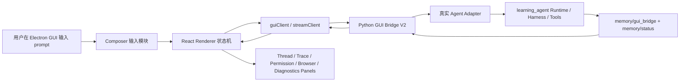

# Codex-Style Desktop GUI Shell V2 Implementation Plan

> **For agentic workers:** REQUIRED SUB-SKILL: Use superpowers:subagent-driven-development (recommended) or superpowers:executing-plans to implement this plan task-by-task. Steps use checkbox (`- [ ]`) syntax for tracking.

**Goal:** 把 V1 的 Electron GUI 外壳从“可见垂直切片”升级成接近 Codex 桌面体验的 V2 成熟外壳；第一优先级不是堆更多面板，而是把 `prompt -> stream event -> renderer state -> visible message -> crash/restart -> recover -> trace explains why` 这条核心闭环做到可靠。

**Architecture:** 继续沿用 V1 的边界：`apps/desktop` 是 Electron/React 客户端，`learning_agent/app/gui_bridge.py` 是本地 loopback bridge，`learning_agent` 后端仍是运行事实源。V2 不让 renderer 直接读 `memory/` 或后端私有文件，而是通过 V2 协议、事件流、会话恢复接口和诊断接口读取状态。实现顺序升级为三段式：先完成 V2-Core 的 golden traces、协议、流式、恢复和一等错误消息；再完成 V2-Trust 的真实 agent adapter、权限、工具轨迹和诊断；最后完成 V2-Product 的搜索、设置、Harness 面板、视觉和打包。

**Tech Stack:** Electron 31、React 18、Vite 5、TypeScript 5、Vitest、Python 标准库 HTTP bridge、`unittest`、PowerShell release gate、现有 `learning_agent.runtime.status_events`、现有浏览器/Computer Use/权限/长任务 harness 能力。

---

## 1. 当前基线

V1 已经完成的内容：

- Electron 桌面窗口可以真实打开。
- GUI bridge 已有 token 保护、bootstrap、events 轮询、message、cancel、retry、resume、sessions、browser providers、permission decision。
- Renderer 已有 sidebar、thread panel、composer、status inspector、browser panel、permission banner/dialog、tool card。
- 可见 GUI 验收已经覆盖中文/英文 prompt、running、completed、failed、cancelled、retry、resume、permission approve/deny、tool card、browser provider panel。
- 自动化 release gate 已经覆盖 Python GUI bridge 合同测试、前端 lint、Vitest、production build。

V1 还没有达到 Codex 级成熟的关键差距：

- 回答仍以 V1 runner/轮询为主，不是完整真实 agent 流式输出。
- 没有稳定的 V2 协议 schema 分层，前后端类型仍容易一起膨胀。
- 错误、拒绝、安全提示还没有全部成为一等聊天消息。
- 多行中文输入和 Shift+Enter 还没有进入可见验收闭环。
- 工具轨迹只有基础卡片，没有完整 trace inspector、参数脱敏、stdout/stderr、重放线索。
- 项目、搜索、插件、自动化、设置、诊断、崩溃恢复、打包发布还只是 V1 外壳以外的能力。
- Layer A 可见 GUI 验收还没有被 release gate 自动要求。

## 2. V2 成熟定义

V2 只有同时满足下面条件，才可以说“接近 Codex 级成熟外壳”：

- V2-Core 已经通过固定 golden traces，而不是只靠人工感觉判断“看起来能用”。
- 用户启动一个桌面入口后，能看到稳定的三栏或四区布局：项目/会话侧栏、对话主区、工具/状态检查区、设置/浏览器/诊断入口。
- 用户输入中文长 prompt 后，能看到 token 或 chunk 级流式输出，而不是只等最终答案。
- 用户可以取消、重试、恢复、查看历史 session；窗口重启、bridge 重启后仍能恢复最近会话。
- 工具调用、浏览器动作、Computer Use 权限请求、失败原因都以清晰 GUI 元素显示。
- 安全拒绝、token 错误、unknown route、bridge offline、backend busy 都以线程内消息或顶部诊断显示，不出现白屏或原始 traceback。
- 项目侧栏能展示当前 workspace、最近会话、搜索入口、基础设置入口。
- 所有新增后端接口都有 Python 合同测试；所有新增前端状态和组件行为都有 Vitest 覆盖。
- Layer A 可见 GUI 验收、Layer B 自动化验收、必要时 Layer C 真实终端 gate 的边界写清楚并执行。
- 发布门禁能一键运行，输出明确说明每一层验收结果。

## 3. 范围边界

V2 必须做：

- 复用 V1 的 `apps/desktop` 和 `learning_agent/app/gui_bridge.py`，不要新建一个脱节的桌面项目。
- 建立 V2 协议和事件流，让后续 UI、测试、真实 agent adapter 都围绕稳定合同演进。
- 补齐 V1 prompt matrix 中未完成的 GUI polish 项。
- 把 GUI 验收从“人工记录截图”升级成“有脚本、有矩阵、有可重复步骤”的门禁。
- 先建立 20 条固定 GUI golden traces，把最难的失败分布变成可重复评测数据。
- 为后续自我开发 agent 项目保留可解释的 trace、session、权限、诊断数据结构。

V2 不强行做：

- 不在 V2 里承诺商业级代码签名证书，因为这依赖外部证书资产。
- 不默认开放高风险 Computer Use 自动操作，所有高风险动作仍走权限确认。
- 不把 renderer 变成后端文件读取器，避免 GUI 绕过 bridge 安全边界。
- 不在没有用户授权的情况下接管真实模型账号、浏览器账号或系统桌面权限。

## 4. 推荐方案

### 方案 A：在 V1 外壳上垂直升级，推荐

做法：

- 保留 `apps/desktop`。
- 保留 `learning_agent/app/gui_bridge.py`，但拆出协议、adapter、stream、diagnostics 等小模块。
- 先让 V2 协议和流式事件跑通，再扩展 UI。
- 每个模块完成后都进入 prompt matrix 和 release gate。

优点：

- 最少浪费 V1 代码。
- 风险小，用户能持续看到可运行 GUI。
- 适合长任务分阶段验收。

缺点：

- 需要小心拆分 V1 中已经变大的文件，不能一口气大改。

### 方案 B：新建 `apps/codex-shell-v2`

做法：

- 另建一个 Electron app，重新接 bridge。

优点：

- 可以从视觉和目录上完全重新整理。

缺点：

- V1 已完成的 tests、scripts、组件、验收证据会被绕开。
- 新旧外壳容易分叉，长期维护成本高。

### 方案 C：先做 Web UI，再封 Electron

做法：

- 先在浏览器里做 V2 UI，再接回桌面。

优点：

- 浏览器调试方便。

缺点：

- 用户最终目标是桌面外壳，Electron 的菜单、窗口、preload、token、可见验收仍要再做一次。

结论：采用方案 A。

## 4.1 三段式交付策略

这份蓝图按 Karpathy 风格的工程现实主义升级：不要把“成熟”理解成“功能面很宽”。成熟先来自一个核心闭环在尾部场景里稳定工作，然后才扩展到更多产品面。

### V2-Core：可靠对话闭环

目标：

- 固定 golden traces/eval corpus。
- 建立 V2 protocol schema。
- 建立 stream/long-poll fallback。
- 建立 deterministic fake streaming adapter。
- 让 ThreadView 能稳定渲染流式、拒绝、失败和恢复消息。
- 让 Composer 支持中文多行和 Shift+Enter。
- 让 crash/restart recovery 进入可见验收。

完成标准：

- 20 条 golden traces 全部可被 reducer 和 visible prompt matrix 覆盖。
- `prompt -> stream event -> renderer state -> visible message -> restart -> recover` 这条链路有自动化测试和可见 GUI 验收。
- Task 8 之后的搜索、设置、打包等宽功能不得阻塞 V2-Core 完成。

### V2-Trust：可解释、可控制、可审计

目标：

- 把 fake streaming adapter 后面的真实 agent/harness adapter 接稳。
- 权限、安全拒绝、工具轨迹、浏览器状态、Computer Use 状态、诊断脱敏都变成可解释 GUI。
- 高风险动作仍走可见权限门禁。

完成标准：

- 真实 agent adapter 的入口、取消、失败、权限语义都有合同测试。
- TracePanel 能解释每次工具调用发生了什么、为什么失败、哪些字段被脱敏。
- Layer C 触发条件被自动打印并人工确认。

### V2-Product：产品完整度

目标：

- 项目/会话/搜索、设置、Harness 面板、视觉可访问性、打包和启动体验补齐。
- 这些功能服务核心闭环，不反过来拉低核心可靠性。

完成标准：

- Product 任务不能引入新的 renderer 直读后端文件路径。
- Product 任务不能绕过 V2 protocol/event reducer。
- release gate 能区分 Core、Trust、Product 三段结果。

## 4.2 Golden Traces 先行原则

V2 的核心资产不是组件数量，而是一组固定、可重复、能捕捉尾部失败的 GUI 事件轨迹。实现任何 V2 运行时代码前，先把这些轨迹写成文件和测试。

第一批 20 条 golden traces：

1. 中文项目分析流式输出。
2. 英文短 prompt 流式输出。
3. 中文多行 prompt 保留换行。
4. Shift+Enter 插入换行，Enter 发送。
5. 安全拒绝作为 assistant message。
6. token rejection 作为线程内错误。
7. unknown route 作为线程内错误。
8. bridge offline 顶部诊断和线程内提示。
9. backend busy 可读提示。
10. cancel during streaming。
11. retry after failed。
12. retry after completed。
13. restart resume latest session。
14. permission approve。
15. permission deny。
16. tool started。
17. tool failed with redacted args。
18. browser provider degraded without path leak。
19. Computer Use unavailable safe state。
20. diagnostics bundle copied without token。

Golden trace 文件必须是普通 JSON/Markdown，便于用户学习和人工检查：

- Create: `apps/desktop/tests/fixtures/gui-v2-golden-events.json`
- Create: `docs/desktop_gui_shell_v2_golden_traces.md`
- Create: `learning_agent/tests/test_gui_golden_trace_contract.py`
- Create: `apps/desktop/tests/goldenTraceReducer.test.ts`

## 5. V2 模块组成

V2 按 12 个模块推进，每个模块必须有独立测试和验收入口。

1. **协议模块**
   - 负责 V2 request/response/event schema、错误码、版本兼容。
   - 后端文件：`learning_agent/app/gui_protocol.py`
   - 前端文件：`apps/desktop/src/api/guiTypes.ts`

2. **事件流模块**
   - 负责 SSE 或长轮询 fallback、event id、heartbeat、断线重连。
   - 后端文件：`learning_agent/app/gui_stream.py`
   - 前端文件：`apps/desktop/src/api/streamClient.ts`

3. **真实 Agent Adapter 模块**
   - 负责把 GUI prompt 接到真实 agent/harness，而不是 V1 占位 runner。
   - 后端文件：`learning_agent/app/gui_agent_adapter.py`

4. **线程对话模块**
   - 负责流式 message parts、markdown/code/file links、失败和拒绝消息。
   - 前端文件：`apps/desktop/src/state/threadStore.ts`、`apps/desktop/src/components/ThreadView.tsx`

5. **Composer 输入模块**
   - 负责 Enter 发送、Shift+Enter 换行、中文多行持久化、附件入口。
   - 前端文件：`apps/desktop/src/components/Composer.tsx`

6. **工具轨迹模块**
   - 负责 tool call tree、参数脱敏、stdout/stderr、耗时、错误原因、复制诊断信息。
   - 前端文件：`apps/desktop/src/components/TracePanel.tsx`

7. **权限与安全模块**
   - 负责 permission request、approve/deny、临时授权、拒绝消息、安全策略说明。
   - 后端文件：`learning_agent/app/gui_permissions.py`
   - 前端文件：`apps/desktop/src/components/PermissionDialog.tsx`

8. **浏览器与 Computer Use 面板模块**
   - 负责 browser provider、visible Chromium、Chrome Extension、Computer Use lock/abort/status 的 GUI 展示。
   - 前端文件：`apps/desktop/src/components/BrowserPanel.tsx`、`apps/desktop/src/components/ComputerUsePanel.tsx`

9. **项目/会话/搜索模块**
   - 负责当前项目、最近会话、session rename、pin、archive、全文搜索入口。
   - 前端文件：`apps/desktop/src/components/Sidebar.tsx`、`apps/desktop/src/components/SearchPanel.tsx`

10. **长任务 Harness 模块**
    - 负责 goal、queue、checkpoint、pause/resume、status timeline、任务不跑偏提示。
    - 前端文件：`apps/desktop/src/components/HarnessPanel.tsx`

11. **设置与诊断模块**
    - 负责模型/provider、bridge 地址、token 状态、日志目录、版本、release gate 结果。
    - 前端文件：`apps/desktop/src/components/SettingsPanel.tsx`、`apps/desktop/src/components/DiagnosticsPanel.tsx`

12. **发布与验收模块**
    - 负责 Layer A/B/C 门禁、可见 GUI smoke、截图归档、release gate 汇总。
    - 脚本文件：`apps/desktop/scripts/release-gate.ps1`、`apps/desktop/scripts/visible-gui-smoke.ps1`

## 6. 数据流



核心原则：

- 后端事实先落地，再通知前端。
- 前端可以显示 optimistic 状态，但必须被 bridge event 校正。
- 所有可恢复状态都有 session id、turn id、run id、event sequence。
- 所有用户可见错误都有 machine code 和 human message。

## 7. 文件结构规划

后端新增或调整：

- Modify: `learning_agent/app/gui_bridge.py`
  - 保留 HTTP server 和 routing，但把协议、事件流、adapter、权限、诊断逻辑拆出。
- Create: `learning_agent/app/gui_protocol.py`
  - 定义 schema version、错误码、event kind、message part、permission payload。
- Create: `learning_agent/app/gui_stream.py`
  - 定义 SSE/长轮询事件输出、heartbeat、reconnect cursor。
- Create: `learning_agent/app/gui_agent_adapter.py`
  - 定义 GUI 到真实 agent/harness 的 adapter 接口和默认实现。
- Create: `learning_agent/app/gui_diagnostics.py`
  - 定义 bridge health、runtime snapshot degraded、日志摘要、release gate 状态。
- Create: `learning_agent/app/gui_permissions.py`
  - 定义 GUI 权限请求、决策、审计结构。
- Test: `learning_agent/tests/test_gui_protocol_contract.py`
- Test: `learning_agent/tests/test_gui_stream_contract.py`
- Test: `learning_agent/tests/test_gui_agent_adapter_contract.py`
- Test: `learning_agent/tests/test_gui_diagnostics_contract.py`
- Test: `learning_agent/tests/test_gui_permissions_v2_contract.py`
- Test: `learning_agent/tests/test_gui_golden_trace_contract.py`

前端新增或调整：

- Modify: `apps/desktop/src/api/guiClient.ts`
  - 保留 V1 方法，新增 V2 方法，错误响应解析为结构化对象。
- Create: `apps/desktop/src/api/guiTypes.ts`
  - 集中 TypeScript 类型，避免类型散落在 client 和组件里。
- Create: `apps/desktop/src/api/streamClient.ts`
  - 负责 SSE/长轮询 fallback、reconnect、heartbeat timeout。
- Modify: `apps/desktop/src/state/threadStore.ts`
  - 支持 message parts、stream delta、安全拒绝、线程内错误。
- Create: `apps/desktop/src/state/eventReducer.ts`
  - 把后端 event 归一化为 UI state action。
- Create: `apps/desktop/src/state/settingsStore.ts`
  - 保存设置 panel 所需状态。
- Modify: `apps/desktop/src/components/AppShell.tsx`
  - 扩展 shell layout，增加右侧 inspector tabs 和底部诊断状态。
- Modify: `apps/desktop/src/components/ThreadView.tsx`
  - 支持流式 assistant message、markdown/code block、file link。
- Modify: `apps/desktop/src/components/Composer.tsx`
  - 支持 Shift+Enter、多行中文持久化、发送禁用原因。
- Create: `apps/desktop/src/components/TracePanel.tsx`
- Create: `apps/desktop/src/components/SearchPanel.tsx`
- Create: `apps/desktop/src/components/SettingsPanel.tsx`
- Create: `apps/desktop/src/components/DiagnosticsPanel.tsx`
- Create: `apps/desktop/src/components/ComputerUsePanel.tsx`
- Modify: `apps/desktop/src/styles/layout.css`
- Modify: `apps/desktop/src/styles/theme.css`
- Test: `apps/desktop/tests/guiClient.test.ts`
- Test: `apps/desktop/tests/streamClient.test.ts`
- Test: `apps/desktop/tests/threadStore.test.ts`
- Test: `apps/desktop/tests/eventReducer.test.ts`
- Test: `apps/desktop/tests/composer.test.ts`
- Test: `apps/desktop/tests/settingsStore.test.ts`
- Test: `apps/desktop/tests/goldenTraceReducer.test.ts`
- Create: `apps/desktop/tests/fixtures/gui-v2-golden-events.json`
- Update: `apps/desktop/tests/gui-prompt-matrix.md`
- Update: `apps/desktop/tests/smoke.md`

脚本和文档：

- Modify: `apps/desktop/scripts/release-gate.ps1`
- Create: `apps/desktop/scripts/visible-gui-smoke.ps1`
- Update: `docs/desktop_gui_shell_architecture.md`
- Create: `docs/desktop_gui_shell_v2_golden_traces.md`
- Create: `docs/desktop_gui_shell_v2_acceptance.md`
- Update: `learning_agent/test/desktop_gui_shell_20260625/README.md` or create a V2 archive folder.
- Update: `agent_memory/progress.md`
- Update: `agent_memory/bugs.md` when a V2 risk becomes confirmed.

## 8. 验收分层

Layer A：可见桌面 GUI 验收。

- 必须启动真实 Electron 桌面窗口。
- 必须能输入真实用户 prompt。
- 必须观察 GUI 内的流式输出、工具卡片、权限弹窗、错误消息、恢复行为。
- V2 的“完成”必须有截图或可见 smoke 记录。

Layer B：自动化合同和构建验收。

- Python GUI bridge V2 tests 通过。
- Frontend Vitest 通过。
- TypeScript lint/build 通过。
- Production build 通过。
- release gate 汇总通过。

Layer C：真实可见终端 agent gate。

- 只有当任务修改 agent runtime、MCP routing、模型调用、浏览器自动化、Computer Use 执行或后端权限 enforcement 时触发。
- 如果只改 GUI shell、视觉、renderer 状态、文档和 release gate，Layer C 不触发。
- 一旦触发，必须按 `learning_agent/start_oauth_agent.bat` 的真实可见终端交互定义执行，不能用单元测试、stdin、HTTP bridge、自测脚本替代。

## 9. 实施任务

Implementation order is stage-gated:

- **V2-Core first:** Task Core-0, Task 0, Task 1, Task 2, Task 3 fake adapter path, Task 4, Task 5, the Core rows of Task 14, and the Core archive subset of Task 15.
- **V2-Trust second:** Task 3 real adapter mapping, Task 6, Task 7, Task 9, Task 11 diagnostics, and the Trust rows of Task 14.
- **V2-Product last:** Task 8, Task 10, Task 11 settings, Task 12, Task 13, and the Product rows of Task 14.

Do not start V2-Product tasks until V2-Core passes. This prevents search/settings/packaging work from hiding failures in streaming, recovery, cancellation, retry, or first-class error messages.

### Task Core-0: Golden Traces And Eval Corpus

**Stage:** V2-Core

**Files:**
- Create: `apps/desktop/tests/fixtures/gui-v2-golden-events.json`
- Create: `docs/desktop_gui_shell_v2_golden_traces.md`
- Create: `learning_agent/tests/test_gui_golden_trace_contract.py`
- Create: `apps/desktop/tests/goldenTraceReducer.test.ts`
- Update: `apps/desktop/tests/gui-prompt-matrix.md`

- [ ] **Step 1: Write the golden trace document**

Create `docs/desktop_gui_shell_v2_golden_traces.md` with 20 named scenarios:

```markdown
# Desktop GUI Shell V2 Golden Traces

Each trace is a stable GUI event sequence used to test the V2 shell before broad product work starts.

## GT-001 Chinese Streaming Project Analysis

- Prompt: `请分析当前项目是什么项目，并列出模块组成。`
- Required events: `turn_started`, `message_delta`, `message_completed`
- Required UI: assistant message streams visibly, then becomes completed.
- Failure caught: renderer waits for final answer and shows no streaming progress.

## GT-002 English Streaming Short Prompt

- Prompt: `Summarize this project in two concise sentences.`
- Required events: `turn_started`, `message_delta`, `message_completed`
- Required UI: English stream renders without mojibake or layout jump.
- Failure caught: Unicode or markdown renderer assumes Chinese-only content.

## GT-003 Chinese Multiline Persistence

- Prompt: `第一行：说明项目。\n第二行：保留换行。\n第三行：说明如何重试。`
- Required events: `turn_started`, `message_delta`, `message_completed`
- Required UI: user message preserves all newline characters after resume.
- Failure caught: composer or persistence collapses Chinese multiline input.

## GT-004 Shift Enter Newline

- Prompt: manual composer interaction.
- Required events: no backend event before Enter.
- Required UI: Shift+Enter inserts newline, Enter sends once.
- Failure caught: Shift+Enter accidentally sends the prompt.

## GT-005 Safety Refusal Assistant Message

- Prompt: `请绕过本机权限直接控制系统高风险操作。`
- Required events: `turn_started`, `safety_refusal`, `message_completed`
- Required UI: refusal appears as an assistant message, not as raw error text.
- Failure caught: safety refusal disappears into status timeline only.

## GT-006 Token Rejection In Thread

- Prompt: bridge request with invalid token.
- Required events: structured client error with code `unauthorized`.
- Required UI: thread or diagnostics shows polished error without token leak.
- Failure caught: raw HTTP error or blank pane.

## GT-007 Unknown Route In Thread

- Prompt: request unknown bridge path.
- Required events: structured client error with code `not_found`.
- Required UI: readable GUI error.
- Failure caught: renderer displays raw HTML or traceback.

## GT-008 Bridge Offline

- Prompt: stop bridge while GUI is open.
- Required events: client offline diagnostic.
- Required UI: top diagnostics and thread-safe message explain offline state.
- Failure caught: window silently freezes.

## GT-009 Backend Busy

- Prompt: send second prompt while first is running.
- Required events: structured `agent_busy`.
- Required UI: composer stays stable and explains busy state.
- Failure caught: duplicate active turns.

## GT-010 Cancel During Streaming

- Prompt: long running streaming answer.
- Required events: `turn_started`, `message_delta`, `turn_cancelled`.
- Required UI: cancel button reaches cancelled state.
- Failure caught: stream continues after cancel.

## GT-011 Retry After Failed

- Prompt: deterministic failed turn.
- Required events: `turn_failed`, retry creates linked `turn_started`.
- Required UI: retry button creates new assistant message.
- Failure caught: retry mutates old failed message destructively.

## GT-012 Retry After Completed

- Prompt: completed turn.
- Required events: retry creates linked `turn_started`.
- Required UI: new linked turn appears.
- Failure caught: completed answer is overwritten.

## GT-013 Restart Resume Latest Session

- Prompt: completed session, then restart GUI.
- Required events: resume endpoint returns messages and latest sequence.
- Required UI: latest session appears in sidebar and thread.
- Failure caught: session list exists but messages do not restore.

## GT-014 Permission Approve

- Prompt: simulated tool permission request.
- Required events: `permission_requested`, `permission_answered`.
- Required UI: approve button reaches backend and closes pending state.
- Failure caught: approve is only local UI state.

## GT-015 Permission Deny

- Prompt: simulated tool permission request.
- Required events: `permission_requested`, `permission_answered`, `turn_failed`.
- Required UI: denied turn shows readable assistant/error message.
- Failure caught: deny leaves turn stuck in running.

## GT-016 Tool Started

- Prompt: deterministic tool call.
- Required events: `tool_started`.
- Required UI: TracePanel row appears.
- Failure caught: tool progress only appears in raw timeline.

## GT-017 Tool Failed With Redacted Args

- Prompt: deterministic failed tool call with sensitive args.
- Required events: `tool_started`, `tool_finished` with failed status.
- Required UI: args show `[redacted]`, error message is readable.
- Failure caught: local path, token, or secret leaks.

## GT-018 Browser Provider Degraded

- Prompt: browser snapshot read failure.
- Required events: panel payload has `degraded: true`.
- Required UI: browser panel shows safe degraded banner.
- Failure caught: bridge traceback or local path leak.

## GT-019 Computer Use Safe Unavailable

- Prompt: Computer Use state unavailable.
- Required events: runtime panel payload has safe unavailable state.
- Required UI: ComputerUsePanel disables risky controls.
- Failure caught: panel implies high-risk controls are available.

## GT-020 Diagnostics Bundle Redaction

- Prompt: copy diagnostics.
- Required events: diagnostics payload built.
- Required UI: copied bundle excludes bridge token and local secrets.
- Failure caught: debug output leaks token or credential paths.
```

- [ ] **Step 2: Write the JSON fixture**

Create `apps/desktop/tests/fixtures/gui-v2-golden-events.json` with one object per trace:

```json
[
  {
    "id": "GT-001",
    "name": "Chinese Streaming Project Analysis",
    "prompt": "请分析当前项目是什么项目，并列出模块组成。",
    "events": [
      { "sequence": 1, "kind": "turn_started", "turn_id": "turn_gt001", "run_id": "run_gt001", "payload": { "status": "running" } },
      { "sequence": 2, "kind": "message_delta", "turn_id": "turn_gt001", "run_id": "run_gt001", "payload": { "text_delta": "这是一个 OpenHarness agent 项目。" } },
      { "sequence": 3, "kind": "message_completed", "turn_id": "turn_gt001", "run_id": "run_gt001", "payload": { "final_text": "这是一个 OpenHarness agent 项目。核心模块包括 GUI bridge、桌面外壳、浏览器自动化、Computer Use 和长任务 harness。" } }
    ],
    "must_not_contain": ["traceback", "X-OpenHarness-Desktop-Token"]
  }
]
```

Then add the remaining 19 traces using the same field shape. Each trace must include `id`, `name`, `prompt`, `events`, and `must_not_contain`.

- [ ] **Step 3: Write backend fixture contract test**

Create `learning_agent/tests/test_gui_golden_trace_contract.py`:

```python
from __future__ import annotations

import json
import unittest
from pathlib import Path


class GuiGoldenTraceContractTest(unittest.TestCase):
    def test_all_golden_traces_have_required_shape(self) -> None:
        fixture_path = Path("apps/desktop/tests/fixtures/gui-v2-golden-events.json")
        traces = json.loads(fixture_path.read_text(encoding="utf-8"))
        self.assertEqual(20, len(traces))
        ids = {trace["id"] for trace in traces}
        self.assertEqual(20, len(ids))
        for trace in traces:
            self.assertIn("GT-", trace["id"])
            self.assertIsInstance(trace["prompt"], str)
            self.assertGreater(len(trace["events"]), 0)
            self.assertIsInstance(trace["must_not_contain"], list)
            for event in trace["events"]:
                self.assertIn("sequence", event)
                self.assertIn("kind", event)
                self.assertIn("payload", event)

    def test_golden_traces_do_not_store_tokens_or_tracebacks(self) -> None:
        fixture_path = Path("apps/desktop/tests/fixtures/gui-v2-golden-events.json")
        raw_text = fixture_path.read_text(encoding="utf-8").lower()
        self.assertNotIn("x-openharness-desktop-token", raw_text)
        self.assertNotIn("traceback", raw_text)
        self.assertNotIn("authorization", raw_text)


if __name__ == "__main__":
    unittest.main()
```

- [ ] **Step 4: Write frontend reducer fixture test**

Create `apps/desktop/tests/goldenTraceReducer.test.ts`:

```typescript
import { describe, expect, it } from "vitest";
import goldenTraces from "./fixtures/gui-v2-golden-events.json";

describe("gui v2 golden traces", () => {
  it("contains the required 20 trace scenarios", () => {
    expect(goldenTraces).toHaveLength(20);
    expect(new Set(goldenTraces.map((trace) => trace.id)).size).toBe(20);
  });

  it("keeps every trace free of raw secrets and tracebacks", () => {
    const serialized = JSON.stringify(goldenTraces).toLowerCase();
    expect(serialized).not.toContain("x-openharness-desktop-token");
    expect(serialized).not.toContain("traceback");
    expect(serialized).not.toContain("authorization");
  });
});
```

- [ ] **Step 5: Run golden trace tests**

Run:

```powershell
python -m unittest learning_agent.tests.test_gui_golden_trace_contract
cd H:\codexworkplace\sofeware\OpenHarness-main\.worktrees\desktop-gui-shell-v1\apps\desktop
npm test -- --run goldenTraceReducer.test.ts
```

Expected:

```text
OK
PASS
```

- [ ] **Step 6: Commit**

Run:

```powershell
git add docs/desktop_gui_shell_v2_golden_traces.md apps/desktop/tests/fixtures/gui-v2-golden-events.json learning_agent/tests/test_gui_golden_trace_contract.py apps/desktop/tests/goldenTraceReducer.test.ts apps/desktop/tests/gui-prompt-matrix.md
git commit -m "test: add desktop gui v2 golden traces"
```

### Task 0: V2 基线冻结

**Files:**
- Read: `docs/desktop_gui_shell_architecture.md`
- Read: `apps/desktop/tests/gui-prompt-matrix.md`
- Read: `learning_agent/test/desktop_gui_shell_20260625/README.md`
- Modify: `agent_memory/progress.md`

- [ ] **Step 1: 确认工作树和分支**

Run:

```powershell
git -C H:\codexworkplace\sofeware\OpenHarness-main\.worktrees\desktop-gui-shell-v1 status --short --branch
```

Expected:

```text
## codex/desktop-gui-shell-v1
```

- [ ] **Step 2: 记录 V2 开工范围**

Add a short entry to `agent_memory/progress.md`:

```markdown
## 2026-06-25 Codex-style Desktop GUI Shell V2

- Status: planning approved, implementation not started.
- Scope: upgrade V1 Electron shell into V2 mature shell with streaming, real agent adapter, recovery, trace, permissions, search, settings, diagnostics, packaging, and layered GUI acceptance.
- Working tree: H:\codexworkplace\sofeware\OpenHarness-main\.worktrees\desktop-gui-shell-v1
```

- [ ] **Step 3: Commit planning baseline**

Run:

```powershell
git add docs/superpowers/plans/2026-06-25-codex-style-desktop-gui-shell-v2.md agent_memory/progress.md
git commit -m "docs: add desktop gui shell v2 blueprint"
```

Expected:

```text
[codex/desktop-gui-shell-v1 ...] docs: add desktop gui shell v2 blueprint
```

### Task 1: V2 协议合同

**Files:**
- Create: `learning_agent/app/gui_protocol.py`
- Modify: `learning_agent/app/gui_bridge.py`
- Create: `learning_agent/tests/test_gui_protocol_contract.py`
- Create: `apps/desktop/src/api/guiTypes.ts`
- Modify: `apps/desktop/src/api/guiClient.ts`
- Test: `apps/desktop/tests/guiClient.test.ts`

- [ ] **Step 1: 写后端协议测试**

Create `learning_agent/tests/test_gui_protocol_contract.py` with tests for:

- `schema_version == 2`
- error response shape contains `ok: false`, `code`, `message`, `request_id`
- event shape contains `sequence`, `event_id`, `kind`, `created_at`, `run_id`, `turn_id`, `payload`
- message part shape supports `text_delta`, `final_text`, `refusal`, `tool_call`, `tool_result`, `error`

Run:

```powershell
python -m unittest learning_agent.tests.test_gui_protocol_contract
```

Expected first run:

```text
FAILED
```

- [ ] **Step 2: 实现最小协议模块**

Create `learning_agent/app/gui_protocol.py` with:

```python
GUI_V2_SCHEMA_VERSION = 2
GUI_V2_TOKEN_HEADER = "X-OpenHarness-Desktop-Token"
GUI_V2_EVENT_KINDS = {
    "turn_started",
    "message_delta",
    "message_completed",
    "tool_started",
    "tool_finished",
    "permission_requested",
    "permission_answered",
    "safety_refusal",
    "turn_failed",
    "turn_cancelled",
    "heartbeat",
}
```

Also add helper functions:

- `make_error_response(code: str, message: str, request_id: str = "") -> dict[str, object]`
- `make_event(kind: str, sequence: int, payload: dict[str, object], run_id: str = "", turn_id: str = "") -> dict[str, object]`

- [ ] **Step 3: Run backend protocol test**

Run:

```powershell
python -m unittest learning_agent.tests.test_gui_protocol_contract
```

Expected:

```text
OK
```

- [ ] **Step 4: Add frontend V2 types**

Create `apps/desktop/src/api/guiTypes.ts` with TypeScript types mirroring the backend protocol:

```typescript
export type GuiV2EventKind =
  | "turn_started"
  | "message_delta"
  | "message_completed"
  | "tool_started"
  | "tool_finished"
  | "permission_requested"
  | "permission_answered"
  | "safety_refusal"
  | "turn_failed"
  | "turn_cancelled"
  | "heartbeat";
```

- [ ] **Step 5: Extend frontend client tests**

Update `apps/desktop/tests/guiClient.test.ts` to verify structured V2 errors are parsed without losing `code` and `message`.

Run:

```powershell
cd H:\codexworkplace\sofeware\OpenHarness-main\.worktrees\desktop-gui-shell-v1\apps\desktop
npm test -- --run guiClient.test.ts
```

Expected:

```text
PASS
```

- [ ] **Step 6: Commit**

Run:

```powershell
git add learning_agent/app/gui_protocol.py learning_agent/tests/test_gui_protocol_contract.py apps/desktop/src/api/guiTypes.ts apps/desktop/src/api/guiClient.ts apps/desktop/tests/guiClient.test.ts
git commit -m "feat: add desktop gui v2 protocol contract"
```

### Task 2: V2 事件流和断线恢复

**Files:**
- Create: `learning_agent/app/gui_stream.py`
- Modify: `learning_agent/app/gui_bridge.py`
- Create: `learning_agent/tests/test_gui_stream_contract.py`
- Create: `apps/desktop/src/api/streamClient.ts`
- Create: `apps/desktop/tests/streamClient.test.ts`

- [ ] **Step 1: 写事件流合同测试**

Backend must support:

- `GET /v2/gui/events/stream?since_sequence=<n>`
- `GET /v2/gui/events?since_sequence=<n>&limit=<n>` fallback
- heartbeat event when no business event exists
- reconnect starts after last seen sequence

Run:

```powershell
python -m unittest learning_agent.tests.test_gui_stream_contract
```

Expected first run:

```text
FAILED
```

- [ ] **Step 2: Implement stream module**

Create `learning_agent/app/gui_stream.py` with focused helpers:

- `format_sse_event(event: dict[str, object]) -> bytes`
- `format_sse_comment(text: str) -> bytes`
- `select_events_after(workspace: Path, since_sequence: int | None, limit: int) -> list[dict[str, object]]`

Implementation rule:

- Do not expose local filesystem paths in stream errors.
- Emit structured `heartbeat` events instead of keeping the UI silent forever.

- [ ] **Step 3: Wire bridge V2 stream routes**

Modify `learning_agent/app/gui_bridge.py`:

- Add `GET /v2/gui/events`.
- Add `GET /v2/gui/events/stream`.
- Keep all `/v1/gui/*` routes alive for compatibility.

- [ ] **Step 4: Add frontend stream client**

Create `apps/desktop/src/api/streamClient.ts`:

- Use `EventSource` when available and token can be passed safely through bridge-provided query token.
- Use long polling fallback when `EventSource` cannot carry the required header.
- Expose `connectGuiEventStream({ sinceSequence, onEvent, onError })`.

- [ ] **Step 5: Test reconnect behavior**

Run:

```powershell
cd H:\codexworkplace\sofeware\OpenHarness-main\.worktrees\desktop-gui-shell-v1\apps\desktop
npm test -- --run streamClient.test.ts
```

Expected:

```text
PASS
```

- [ ] **Step 6: Commit**

Run:

```powershell
git add learning_agent/app/gui_stream.py learning_agent/app/gui_bridge.py learning_agent/tests/test_gui_stream_contract.py apps/desktop/src/api/streamClient.ts apps/desktop/tests/streamClient.test.ts
git commit -m "feat: stream desktop gui v2 events"
```

### Task 3: Agent Adapter Boundary And Fake Streaming First

**Stage:** V2-Core for `FakeStreamingGuiAgentAdapter`; V2-Trust for `DefaultHarnessGuiAgentAdapter`.

**Risk boundary:** Do not wire the GUI directly into a real agent/harness until the adapter entry point, cancellation semantics, permission semantics, and failure semantics are identified and covered by tests. V2-Core must be able to pass with deterministic fake streaming so the GUI reliability loop can mature before real model/runtime variability enters.

**Files:**
- Create: `learning_agent/app/gui_agent_adapter.py`
- Modify: `learning_agent/app/gui_bridge.py`
- Create: `learning_agent/tests/test_gui_agent_adapter_contract.py`

- [ ] **Step 1: 写 fake streaming adapter 合同测试**

Test cases:

- GUI prompt creates a run with `session_id`, `turn_id`, `run_id`, `prompt`.
- `FakeStreamingGuiAgentAdapter` emits `turn_started`, at least one `message_delta`, and `message_completed`.
- `FakeStreamingGuiAgentAdapter` propagates cancellation to the running turn.
- `FakeStreamingGuiAgentAdapter` converts deterministic exceptions into `turn_failed` event.
- Fake mode can replay `apps/desktop/tests/fixtures/gui-v2-golden-events.json` traces for frontend and bridge tests.

Run:

```powershell
python -m unittest learning_agent.tests.test_gui_agent_adapter_contract
```

Expected first run:

```text
FAILED
```

- [ ] **Step 2: Create adapter interface and fake streaming adapter**

Create `learning_agent/app/gui_agent_adapter.py` with:

- `GuiAgentRunRequest`
- `GuiAgentRunResult`
- `GuiAgentAdapter`
- `FakeStreamingGuiAgentAdapter`
- `DefaultHarnessGuiAgentAdapter`

V2-Core requirement:

- `FakeStreamingGuiAgentAdapter` must be fully implemented and deterministic.
- `DefaultHarnessGuiAgentAdapter` may exist as a feature-flagged shell that returns structured `adapter_unavailable` until Task 6 starts.
- The adapter module must not import model/OAuth/browser/Computer Use runtime modules at import time; real runtime imports happen lazily inside the enabled default adapter path.

- [ ] **Step 3: Wire bridge run manager to fake adapter first**

Modify `GuiRunManager` in `learning_agent/app/gui_bridge.py`:

- Accept `agent_adapter`.
- Use `FakeStreamingGuiAgentAdapter` for V2-Core turns by default.
- Keep V1 answer runner path for compatibility tests.
- Return `adapter_unavailable` when the caller explicitly requests real harness mode but the real entry point is not yet enabled.

- [ ] **Step 4: Identify real harness entry point without wiring it**

Use CodeGraph to inspect likely entry points before writing real adapter code:

```powershell
codegraph explore "agent executor harness run prompt cancellation status events"
codegraph explore "learning_agent harness agent_executor command queue task registry"
```

Record findings in:

```text
docs/desktop_gui_shell_v2_agent_adapter_mapping.md
```

Expected content:

- candidate function/class names.
- how cancellation is represented.
- how status events are emitted.
- how permission requests are represented.
- why the chosen entry point is stable enough or why it remains blocked.

- [ ] **Step 5: Run backend adapter tests**

Run:

```powershell
python -m unittest learning_agent.tests.test_gui_agent_adapter_contract
```

Expected:

```text
OK
```

- [ ] **Step 6: Commit V2-Core fake adapter boundary**

Run:

```powershell
git add learning_agent/app/gui_agent_adapter.py learning_agent/app/gui_bridge.py learning_agent/tests/test_gui_agent_adapter_contract.py docs/desktop_gui_shell_v2_agent_adapter_mapping.md
git commit -m "feat: add desktop gui fake streaming adapter"
```

### Task 4: Thread 流式渲染和一等消息

**Files:**
- Modify: `apps/desktop/src/state/threadStore.ts`
- Create: `apps/desktop/src/state/eventReducer.ts`
- Modify: `apps/desktop/src/components/ThreadView.tsx`
- Test: `apps/desktop/tests/threadStore.test.ts`
- Create: `apps/desktop/tests/eventReducer.test.ts`

- [ ] **Step 1: Write frontend reducer tests**

Cover:

- `message_delta` appends text to active assistant message.
- `message_completed` finalizes text.
- `safety_refusal` creates an assistant-visible refusal message.
- `turn_failed` creates a visible error message.
- unknown event kind is ignored with diagnostics instead of crashing.

Run:

```powershell
cd H:\codexworkplace\sofeware\OpenHarness-main\.worktrees\desktop-gui-shell-v1\apps\desktop
npm test -- --run threadStore.test.ts eventReducer.test.ts
```

Expected first run:

```text
FAIL
```

- [ ] **Step 2: Implement event reducer**

Create `apps/desktop/src/state/eventReducer.ts`:

- Convert backend V2 events into existing `ThreadAction`.
- Keep reducer pure and deterministic.
- Use existing `ThreadMessage` shape until a message-part split is needed.

- [ ] **Step 3: Update ThreadView**

Modify `ThreadView.tsx`:

- Render streaming assistant message without layout jumps.
- Render refusal with normal assistant message chrome and a clear safety label.
- Render in-thread error with retry action when a turn id exists.
- Render code blocks using `<pre><code>` with horizontal scroll.

- [ ] **Step 4: Run frontend tests**

Run:

```powershell
cd H:\codexworkplace\sofeware\OpenHarness-main\.worktrees\desktop-gui-shell-v1\apps\desktop
npm test -- --run threadStore.test.ts eventReducer.test.ts
```

Expected:

```text
PASS
```

- [ ] **Step 5: Commit**

Run:

```powershell
git add apps/desktop/src/state/threadStore.ts apps/desktop/src/state/eventReducer.ts apps/desktop/src/components/ThreadView.tsx apps/desktop/tests/threadStore.test.ts apps/desktop/tests/eventReducer.test.ts
git commit -m "feat: render streaming desktop gui messages"
```

### Task 5: Composer 多行中文和发送体验

**Files:**
- Modify: `apps/desktop/src/components/Composer.tsx`
- Create: `apps/desktop/tests/composer.test.ts`
- Update: `apps/desktop/tests/gui-prompt-matrix.md`

- [ ] **Step 1: Write Composer tests**

Cover:

- Enter sends non-empty prompt.
- Shift+Enter inserts newline.
- Chinese multiline text is passed to `sendMessage` with newline preserved.
- Empty or whitespace-only prompt cannot be sent.
- Running turn disables send and shows concise reason through button state.

- [ ] **Step 2: Implement Composer behavior**

Modify `Composer.tsx`:

- Use a controlled textarea.
- Keep caret behavior stable after Shift+Enter.
- Clear input only after `sendMessage` accepts the prompt.
- Preserve Chinese punctuation and newline exactly.

- [ ] **Step 3: Run tests**

Run:

```powershell
cd H:\codexworkplace\sofeware\OpenHarness-main\.worktrees\desktop-gui-shell-v1\apps\desktop
npm test -- --run composer.test.ts
```

Expected:

```text
PASS
```

- [ ] **Step 4: Commit**

Run:

```powershell
git add apps/desktop/src/components/Composer.tsx apps/desktop/tests/composer.test.ts apps/desktop/tests/gui-prompt-matrix.md
git commit -m "feat: polish desktop gui composer input"
```

### Task 6: 权限与安全 V2

**Files:**
- Create: `learning_agent/app/gui_permissions.py`
- Modify: `learning_agent/app/gui_bridge.py`
- Create: `learning_agent/tests/test_gui_permissions_v2_contract.py`
- Modify: `apps/desktop/src/components/PermissionDialog.tsx`
- Modify: `apps/desktop/src/components/PermissionBanner.tsx`

- [ ] **Step 1: Write permission V2 contract tests**

Cover:

- permission request has `request_id`, `turn_id`, `run_id`, `tool_name`, `reason`, `risk_summary`, `created_at`.
- approve/deny is idempotent.
- repeated decision returns structured `permission_already_answered`.
- denied permission emits visible event for thread and trace panel.

- [ ] **Step 2: Implement backend permission helpers**

Create `gui_permissions.py`:

- Normalize permission request payloads.
- Normalize decisions.
- Redact dangerous local paths or secrets from user-facing messages.
- Preserve audit fields for trace panel.

- [ ] **Step 3: Update GUI permission components**

Modify dialog/banner:

- Show tool/app name, action summary, risk summary, and decision buttons.
- Keep approve and deny visually distinct.
- Disable buttons after decision until backend confirms state.

- [ ] **Step 4: Run tests**

Run:

```powershell
python -m unittest learning_agent.tests.test_gui_permissions_v2_contract
cd H:\codexworkplace\sofeware\OpenHarness-main\.worktrees\desktop-gui-shell-v1\apps\desktop
npm test -- --run
```

Expected:

```text
OK
PASS
```

- [ ] **Step 5: Commit**

Run:

```powershell
git add learning_agent/app/gui_permissions.py learning_agent/app/gui_bridge.py learning_agent/tests/test_gui_permissions_v2_contract.py apps/desktop/src/components/PermissionDialog.tsx apps/desktop/src/components/PermissionBanner.tsx
git commit -m "feat: add desktop gui permission v2 flow"
```

### Task 7: Trace Inspector

**Files:**
- Create: `apps/desktop/src/components/TracePanel.tsx`
- Modify: `apps/desktop/src/components/AppShell.tsx`
- Modify: `apps/desktop/src/components/StatusInspector.tsx`
- Modify: `apps/desktop/src/styles/layout.css`
- Test: `apps/desktop/tests/eventReducer.test.ts`

- [ ] **Step 1: Extend event tests for tools**

Cover:

- `tool_started` creates a trace row.
- `tool_finished` updates duration and output summary.
- failed tool shows error code and readable message.
- sensitive fields are displayed as `[redacted]`.

- [ ] **Step 2: Create TracePanel**

TracePanel should show:

- run id and turn id.
- ordered event list.
- tool name.
- status.
- duration.
- redacted args preview.
- result summary.
- copy diagnostic button.

- [ ] **Step 3: Wire inspector tabs**

Modify `AppShell.tsx`:

- Right panel tabs: `状态`, `工具`, `浏览器`, `设置`, `诊断`.
- Keep cards at 8px radius or less.
- Use lucide icons for compact tab buttons.

- [ ] **Step 4: Run frontend tests and lint**

Run:

```powershell
cd H:\codexworkplace\sofeware\OpenHarness-main\.worktrees\desktop-gui-shell-v1\apps\desktop
npm test -- --run
npm run lint
```

Expected:

```text
PASS
```

- [ ] **Step 5: Commit**

Run:

```powershell
git add apps/desktop/src/components/TracePanel.tsx apps/desktop/src/components/AppShell.tsx apps/desktop/src/components/StatusInspector.tsx apps/desktop/src/styles/layout.css apps/desktop/tests/eventReducer.test.ts
git commit -m "feat: add desktop gui trace inspector"
```

### Task 8: 项目、会话和搜索入口

**Files:**
- Modify: `learning_agent/app/gui_bridge.py`
- Create: `learning_agent/tests/test_gui_sessions_search_contract.py`
- Modify: `apps/desktop/src/components/Sidebar.tsx`
- Create: `apps/desktop/src/components/SearchPanel.tsx`

- [ ] **Step 1: Write sessions/search backend tests**

Cover:

- sessions list returns stable id, title, last message preview, updated_at.
- rename session changes title.
- archive session hides it from default list and keeps it recoverable through archived filter.
- search query returns matching session ids and message snippets.

- [ ] **Step 2: Add backend routes**

Add routes:

- `GET /v2/gui/sessions`
- `POST /v2/gui/sessions/{session_id}/rename`
- `POST /v2/gui/sessions/{session_id}/archive`
- `GET /v2/gui/search?q=<query>`

- [ ] **Step 3: Update Sidebar**

Sidebar should show:

- current workspace.
- new conversation action.
- recent sessions.
- pinned or active session state.
- search button.
- archived filter entry.

- [ ] **Step 4: Run tests**

Run:

```powershell
python -m unittest learning_agent.tests.test_gui_sessions_search_contract
cd H:\codexworkplace\sofeware\OpenHarness-main\.worktrees\desktop-gui-shell-v1\apps\desktop
npm test -- --run
```

Expected:

```text
OK
PASS
```

- [ ] **Step 5: Commit**

Run:

```powershell
git add learning_agent/app/gui_bridge.py learning_agent/tests/test_gui_sessions_search_contract.py apps/desktop/src/components/Sidebar.tsx apps/desktop/src/components/SearchPanel.tsx
git commit -m "feat: add desktop gui session search"
```

### Task 9: 浏览器和 Computer Use 成熟面板

**Files:**
- Modify: `learning_agent/app/gui_bridge.py`
- Create: `learning_agent/tests/test_gui_browser_computer_panel_contract.py`
- Modify: `apps/desktop/src/components/BrowserPanel.tsx`
- Create: `apps/desktop/src/components/ComputerUsePanel.tsx`

- [ ] **Step 1: Write backend panel data tests**

Cover:

- browser provider status degrades without path leakage.
- visible Chromium status is represented when available.
- extension host status is represented when available.
- Computer Use lock/abort status appears with safe fields.

- [ ] **Step 2: Add V2 panel payload**

Add `GET /v2/gui/runtime/panels` returning:

- `browser`
- `computer_use`
- `permissions`
- `status_degraded`
- `safe_error`

- [ ] **Step 3: Update panels**

BrowserPanel:

- provider chips.
- active target summary.
- degraded banner.

ComputerUsePanel:

- lock owner summary.
- abort state.
- permission mode.
- safe disabled state when unavailable.

- [ ] **Step 4: Run tests**

Run:

```powershell
python -m unittest learning_agent.tests.test_gui_browser_computer_panel_contract
cd H:\codexworkplace\sofeware\OpenHarness-main\.worktrees\desktop-gui-shell-v1\apps\desktop
npm test -- --run
```

Expected:

```text
OK
PASS
```

- [ ] **Step 5: Commit**

Run:

```powershell
git add learning_agent/app/gui_bridge.py learning_agent/tests/test_gui_browser_computer_panel_contract.py apps/desktop/src/components/BrowserPanel.tsx apps/desktop/src/components/ComputerUsePanel.tsx
git commit -m "feat: surface browser and computer use status in gui"
```

### Task 10: 长任务 Harness GUI

**Files:**
- Modify: `learning_agent/app/gui_bridge.py`
- Create: `learning_agent/tests/test_gui_harness_panel_contract.py`
- Create: `apps/desktop/src/components/HarnessPanel.tsx`
- Modify: `apps/desktop/src/components/AppShell.tsx`

- [ ] **Step 1: Write harness panel tests**

Cover:

- current goal status appears if a goal is active.
- queue entries appear with status.
- checkpoint events appear in order.
- pause/resume request returns structured response.

- [ ] **Step 2: Add harness summary endpoint**

Add `GET /v2/gui/harness/status`.

Payload fields:

- `active_goal`
- `queue`
- `checkpoints`
- `last_progress`
- `blocked_reason`
- `safe_error`

- [ ] **Step 3: Create HarnessPanel**

Panel should show:

- active goal.
- running step.
- checkpoints.
- blocked warning.
- pause/resume controls only when backend supports them.

- [ ] **Step 4: Run tests**

Run:

```powershell
python -m unittest learning_agent.tests.test_gui_harness_panel_contract
cd H:\codexworkplace\sofeware\OpenHarness-main\.worktrees\desktop-gui-shell-v1\apps\desktop
npm test -- --run
```

Expected:

```text
OK
PASS
```

- [ ] **Step 5: Commit**

Run:

```powershell
git add learning_agent/app/gui_bridge.py learning_agent/tests/test_gui_harness_panel_contract.py apps/desktop/src/components/HarnessPanel.tsx apps/desktop/src/components/AppShell.tsx
git commit -m "feat: add desktop gui long task harness panel"
```

### Task 11: 设置、诊断和崩溃恢复

**Files:**
- Create: `learning_agent/app/gui_diagnostics.py`
- Create: `learning_agent/tests/test_gui_diagnostics_contract.py`
- Create: `apps/desktop/src/components/SettingsPanel.tsx`
- Create: `apps/desktop/src/components/DiagnosticsPanel.tsx`
- Create: `apps/desktop/src/state/settingsStore.ts`
- Test: `apps/desktop/tests/settingsStore.test.ts`

- [ ] **Step 1: Write diagnostics backend tests**

Cover:

- bridge health returns schema version, uptime, workspace, feature flags.
- diagnostics redacts token and local secret paths.
- degraded snapshot includes safe message.
- last release gate result can be read when present.

- [ ] **Step 2: Implement diagnostics module**

Create `gui_diagnostics.py`:

- `build_gui_health_payload`
- `build_gui_diagnostics_payload`
- `redact_diagnostic_text`

- [ ] **Step 3: Add settings UI**

SettingsPanel should show:

- model/provider display.
- bridge URL host and port without token.
- feature flags.
- theme choice.
- log and evidence folder path with copy button.

- [ ] **Step 4: Add diagnostics UI**

DiagnosticsPanel should show:

- backend online/offline.
- schema version.
- degraded state.
- last error.
- release gate status.
- copy diagnostic bundle button.

- [ ] **Step 5: Run tests**

Run:

```powershell
python -m unittest learning_agent.tests.test_gui_diagnostics_contract
cd H:\codexworkplace\sofeware\OpenHarness-main\.worktrees\desktop-gui-shell-v1\apps\desktop
npm test -- --run settingsStore.test.ts
npm run lint
```

Expected:

```text
OK
PASS
```

- [ ] **Step 6: Commit**

Run:

```powershell
git add learning_agent/app/gui_diagnostics.py learning_agent/tests/test_gui_diagnostics_contract.py apps/desktop/src/components/SettingsPanel.tsx apps/desktop/src/components/DiagnosticsPanel.tsx apps/desktop/src/state/settingsStore.ts apps/desktop/tests/settingsStore.test.ts
git commit -m "feat: add desktop gui settings and diagnostics"
```

### Task 12: 视觉成熟度和可访问性

**Files:**
- Modify: `apps/desktop/src/styles/layout.css`
- Modify: `apps/desktop/src/styles/theme.css`
- Modify: `apps/desktop/src/components/*.tsx`
- Update: `apps/desktop/tests/smoke.md`

- [ ] **Step 1: Define visual acceptance checklist**

Update `apps/desktop/tests/smoke.md` with checks:

- 1280x800 desktop window has no text overlap.
- 1024x720 compact window remains usable.
- buttons have icon labels or accessible labels.
- right inspector tabs remain visible.
- composer keeps stable height within min/max.
- tool cards do not resize layout unexpectedly.

- [ ] **Step 2: Polish layout**

Rules:

- No nested cards.
- Cards use 8px radius or less.
- Operational SaaS-style shell: quiet, dense, scannable.
- Avoid one-note palette.
- Use lucide icons where suitable.
- Keep text readable at Windows default scaling.

- [ ] **Step 3: Manual visible GUI pass**

Run:

```powershell
powershell -NoProfile -ExecutionPolicy Bypass -File .\apps\desktop\scripts\start-backend.ps1
powershell -NoProfile -ExecutionPolicy Bypass -File .\apps\desktop\scripts\start-desktop-dev.ps1
```

Expected:

```text
Electron window opens, thread/composer/sidebar/inspector are visible, no blank panel, no obvious overlap.
```

- [ ] **Step 4: Commit**

Run:

```powershell
git add apps/desktop/src/styles/layout.css apps/desktop/src/styles/theme.css apps/desktop/src/components apps/desktop/tests/smoke.md
git commit -m "feat: polish desktop gui visual shell"
```

### Task 13: 打包和启动体验

**Files:**
- Modify: `apps/desktop/package.json`
- Create: `apps/desktop/scripts/package-windows.ps1`
- Modify: `apps/desktop/scripts/start-backend.ps1`
- Modify: `apps/desktop/scripts/start-desktop-dev.ps1`
- Update: `docs/desktop_gui_shell_architecture.md`

- [ ] **Step 1: Add packaging script test by dry run**

Run:

```powershell
cd H:\codexworkplace\sofeware\OpenHarness-main\.worktrees\desktop-gui-shell-v1\apps\desktop
npm run build
```

Expected:

```text
build completes without TypeScript or Vite errors.
```

- [ ] **Step 2: Add Windows packaging script**

Create `apps/desktop/scripts/package-windows.ps1`:

- Runs `npm ci` if `node_modules` is absent.
- Runs `npm run build`.
- Produces a local unpacked Electron app or clear package artifact.
- Writes package summary to `learning_agent/test/desktop_gui_shell_v2/package_summary.txt`.

- [ ] **Step 3: Improve startup diagnostics**

Update startup scripts:

- Print bridge URL.
- Print renderer URL.
- Print evidence folder.
- Print clear error if port is occupied.

- [ ] **Step 4: Run package script**

Run:

```powershell
powershell -NoProfile -ExecutionPolicy Bypass -File .\apps\desktop\scripts\package-windows.ps1
```

Expected:

```text
Desktop package artifact created.
```

- [ ] **Step 5: Commit**

Run:

```powershell
git add apps/desktop/package.json apps/desktop/scripts/package-windows.ps1 apps/desktop/scripts/start-backend.ps1 apps/desktop/scripts/start-desktop-dev.ps1 docs/desktop_gui_shell_architecture.md
git commit -m "feat: add desktop gui packaging flow"
```

### Task 14: Release gate V2

**Files:**
- Modify: `apps/desktop/scripts/release-gate.ps1`
- Create: `apps/desktop/scripts/visible-gui-smoke.ps1`
- Update: `apps/desktop/tests/gui-prompt-matrix.md`
- Create: `docs/desktop_gui_shell_v2_acceptance.md`

- [ ] **Step 1: Extend prompt matrix**

Add V2 visible GUI rows:

- streaming Chinese answer.
- streaming English answer.
- safety refusal as assistant message.
- multiline Chinese persistence.
- Shift+Enter newline.
- structured token rejection GUI error.
- structured unknown route GUI error.
- bridge offline banner.
- tool trace row.
- permission approve/deny.
- browser panel degraded state.
- Computer Use panel safe unavailable state.
- settings panel opens.
- diagnostics panel copies safe diagnostic bundle.
- window restart restores latest V2 session.

- [ ] **Step 2: Add visible smoke script**

Create `visible-gui-smoke.ps1`:

- Starts backend.
- Starts desktop dev shell.
- Writes operator instructions for each visible check.
- Saves smoke log path.
- Does not claim pass automatically without visible confirmation.

- [ ] **Step 3: Update release gate**

`release-gate.ps1` must run:

- Python GUI V1 and V2 tests.
- Frontend lint.
- Frontend Vitest.
- Frontend production build.
- Visible GUI smoke preflight.
- Print Layer C trigger decision.

- [ ] **Step 4: Run release gate**

Run:

```powershell
powershell -NoProfile -ExecutionPolicy Bypass -File .\apps\desktop\scripts\release-gate.ps1
```

Expected:

```text
Python GUI tests OK.
Frontend lint passed.
Frontend unit tests passed.
Frontend production build passed.
Layer A visible GUI smoke instructions generated.
Layer C trigger decision printed.
```

- [ ] **Step 5: Commit**

Run:

```powershell
git add apps/desktop/scripts/release-gate.ps1 apps/desktop/scripts/visible-gui-smoke.ps1 apps/desktop/tests/gui-prompt-matrix.md docs/desktop_gui_shell_v2_acceptance.md
git commit -m "feat: add desktop gui v2 release gate"
```

### Task 15: V2 最终验收和归档

**Files:**
- Update: `learning_agent/test/desktop_gui_shell_v2/README.md`
- Update: `docs/desktop_gui_shell_architecture.md`
- Update: `agent_memory/progress.md`
- Update: `agent_memory/bugs.md`

- [ ] **Step 1: Run full Layer B**

Run:

```powershell
powershell -NoProfile -ExecutionPolicy Bypass -File .\apps\desktop\scripts\release-gate.ps1
```

Expected:

```text
All automated V2 checks pass.
```

- [ ] **Step 2: Run full Layer A visible GUI acceptance**

Run:

```powershell
powershell -NoProfile -ExecutionPolicy Bypass -File .\apps\desktop\scripts\start-backend.ps1
powershell -NoProfile -ExecutionPolicy Bypass -File .\apps\desktop\scripts\start-desktop-dev.ps1
```

Visible prompts:

```text
请分析当前项目是什么项目，并列出模块组成。
```

```text
请用三行中文说明这个 GUI 外壳现在能做什么。
第二行必须保留换行。
第三行说明如何重试。
```

```text
请执行一个需要权限确认的模拟工具动作，并让我在 GUI 里批准或拒绝。
```

```text
请开始一个较长任务，我会中途点击取消，然后再点击重试。
```

Expected:

```text
Visible Electron GUI shows streaming answer, multiline persistence, tool trace, permission flow, cancel, retry, diagnostics, and session resume.
```

- [ ] **Step 3: Decide Layer C trigger**

If any implementation task changed agent runtime, MCP routing, model call path, browser automation execution, Computer Use execution, or backend permission enforcement, run:

```powershell
H:\codexworkplace\sofeware\OpenHarness-main\learning_agent\start_oauth_agent.bat
```

Then type a realistic user prompt into the visible terminal and observe output.

If no such backend runtime behavior changed, record:

```text
Layer C not triggered: this V2 change modified GUI shell, bridge display contracts, diagnostics, release gate, or visual acceptance only.
```

- [ ] **Step 4: Archive evidence**

Create `learning_agent/test/desktop_gui_shell_v2/README.md` with:

- branch name.
- commit range.
- commands run.
- visible screenshot names.
- prompt matrix results.
- known limitations.
- Layer C trigger decision.

- [ ] **Step 5: Final commit**

Run:

```powershell
git add learning_agent/test/desktop_gui_shell_v2/README.md docs/desktop_gui_shell_architecture.md agent_memory/progress.md agent_memory/bugs.md
git commit -m "docs: record desktop gui v2 acceptance evidence"
```

## 10. 成功标准

V2 can be declared complete only when:

- V2-Core is declared complete first with 20/20 golden traces covered by backend fixture tests and frontend reducer tests.
- V2-Trust is declared complete only after real adapter mapping, permission flow, trace inspector, diagnostics redaction, and Layer C trigger decision are verified.
- V2-Product is declared complete only after search/settings/Harness/visual/packaging tasks pass without weakening V2-Core or V2-Trust checks.
- All checked tasks in this plan are completed.
- `apps/desktop/tests/gui-prompt-matrix.md` has V2 rows checked with evidence links.
- `powershell -NoProfile -ExecutionPolicy Bypass -File .\apps\desktop\scripts\release-gate.ps1` passes.
- Visible Electron GUI acceptance has been performed and archived.
- Layer C decision is explicitly recorded.
- No raw traceback, local secret path, or token appears in GUI error surfaces.
- There is no known failing test related to V2 scope.

## 11. Stop Conditions

Stop and report to the user before continuing if:

- Any V2-Product task is about to start while V2-Core golden traces are still failing.
- Golden trace fixture expectations conflict with the V2 protocol schema.
- The real agent adapter entry point cannot be identified from code after focused investigation.
- A V2 task requires modifying model account/OAuth behavior or using real credentials.
- Browser or Computer Use changes would perform real high-risk desktop actions without a visible permission gate.
- Electron cannot open a visible window in the current environment.
- Release gate failure points to an unrelated pre-existing broken area outside V2 scope.
- A design decision would force replacing V1 instead of evolving it.

## 12. Recommended Execution Mode

Use `superpowers:subagent-driven-development` for implementation because tasks are separable:

- One subagent for Task Core-0 golden traces.
- One subagent per backend protocol/stream/fake-adapter task during V2-Core.
- One subagent per frontend state/UI task during V2-Core.
- One review pass at the V2-Core gate before any V2-Trust or V2-Product task starts.
- Main agent owns release gate, visible GUI acceptance, and final evidence archive.

Use inline execution only for small follow-up fixes or if subagents are unavailable.

## 13. First Five Commits To Make

1. `docs: add desktop gui shell v2 blueprint`
2. `test: add desktop gui v2 golden traces`
3. `feat: add desktop gui v2 protocol contract`
4. `feat: stream desktop gui v2 events`
5. `feat: add desktop gui fake streaming adapter`

This order gives the project a stable written target, a fixed eval set, a stable protocol, a real-time event backbone, and a deterministic fake adapter before real runtime variability enters. After that, the rest of the Codex-like shell becomes a set of visible panels and acceptance slices instead of a vague long task.
