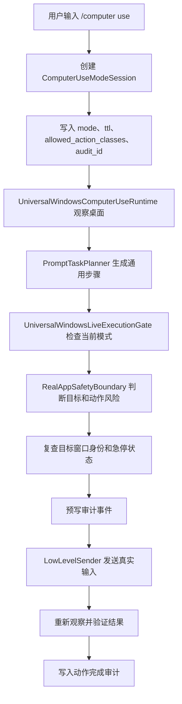

# Universal Computer Use Permission Mode Design

## 背景

用户指出一个关键架构问题：如果每个 Windows 应用都要提前加入白名单，Computer Use 就会退化成“很多应用专用控制器”，而不是真正的通用桌面控制能力。

这个判断是正确的。项目已经有 Phase92 的 `UniversalWindowsComputerUseRuntime` 和 Phase93 的 `UniversalWindowsLiveExecutionGate`，它们都在强调单一通用运行时、观察规划执行验证闭环、代表性应用只作为验收样本。后续设计必须沿着这条线继续，而不是继续给 Notepad、Paint、Explorer 分别堆专用权限路径。

## 设计目标

新的 Computer Use 权限模式要让用户输入类似 `/computer use` 后进入一个通用桌面控制 session。这个 session 面向“任意普通 Windows 应用”，而不是面向固定应用清单。

目标能力如下：

- `/computer use` 开启普通通用控制模式，允许 agent 观察、点击、输入、拖拽、复制粘贴、保存普通文件和操作普通窗口。
- `/computer use --observe` 开启只观察模式，agent 只能看屏幕、窗口、UIA、OCR、状态和日志，不发送真实输入。
- `/computer use --full` 开启高风险完全接管候选模式，允许更宽的动作面，但必须经过强确认、短时限、急停和审计。
- `/computer stop` 立即终止当前 Computer Use session，并阻断后续低层输入。
- `/computer status` 显示当前模式、授权等级、目标窗口、剩余时间、最近动作和急停状态。
- `/computer permissions` 显示本轮 session 允许和禁止的动作类别。

## 非目标

本设计明确不做以下事情：

- 不为每个应用维护长期白名单。
- 不为每个应用写一个专用 controller 作为主架构。
- 不把 Notepad、Paint、Explorer、Browser 的验收样本当成产品能力边界。
- 不让普通 `/computer use` 默认绕过终端、管理员窗口、系统设置、支付、密码、验证码、登录、私钥、API key 等高风险目标。
- 不允许模型在没有目标复查、急停检查和审计记录的情况下发送低层鼠标键盘事件。
- 不把“可以全权限接管”伪装成默认安全模式。

## 推荐架构

推荐架构是“通用模式授权 + 动作风险分级 + 目标风险拦截”，而不是应用白名单。

核心思想：

```text
用户命令
-> ComputerUseModeSession
-> UniversalWindowsComputerUseRuntime
-> UniversalWindowsLiveExecutionGate
-> RealAppSafetyBoundary
-> LowLevelSender
```

`ComputerUseModeSession` 保存当前用户打开的 Computer Use 模式，例如 observe、normal、full。它不保存“允许 Notepad、允许 Paint”这种应用白名单，而是保存允许的动作类别、时间范围、急停状态和风险等级。

`UniversalWindowsComputerUseRuntime` 继续负责通用观察、规划、动作生成和验证。它必须保持“不依赖应用专用 controller”的约束。

`UniversalWindowsLiveExecutionGate` 继续负责把通用动作接入真实执行门。它要读取当前模式 session，判断本轮是否允许真实输入。

`RealAppSafetyBoundary` 继续保留危险目标判断。这个边界不是应用白名单，而是风险黑名单和二次确认门。

`LowLevelSender` 只接收已经通过模式授权、目标复查、动作风险判断、急停检查和审计预写的事件。

## 权限等级

### Observe Mode

命令：

```text
/computer use --observe
```

含义：

- 只允许观察，不允许真实点击、键盘输入、剪贴板写入或拖拽。
- 可以读取窗口列表、当前焦点窗口、截图摘要、UIA 树、OCR 结果和 Computer Use 状态。
- 适合让 agent 先判断“现在电脑上发生了什么”。

成功标准：

- `real_desktop_touched=false`
- `low_level_event_count=0`
- `mode=observe`

### Normal Mode

命令：

```text
/computer use
```

含义：

- 开启普通通用桌面控制。
- 不需要提前把每个应用加入白名单。
- 允许操作普通窗口和普通动作，例如点击按钮、输入文本、选择菜单、滚动、拖拽、复制粘贴、保存受控文件。
- 高风险窗口和高风险动作仍然拒绝或二次确认。

允许动作类别：

- `observe_screen`
- `list_windows`
- `focus_window`
- `click`
- `double_click`
- `type_text`
- `hotkey_safe`
- `scroll`
- `drag`
- `clipboard_temporary_text`
- `save_current_document`

默认禁止或需要确认的动作类别：

- 终端命令执行。
- 管理员窗口操作。
- 系统设置修改。
- 删除大量文件。
- 安装、卸载或升级软件。
- 登录、支付、提交订单、发送消息。
- 输入密码、验证码、2FA、token、API key、私钥。
- 绕过安全软件、UAC、浏览器安全提示。

成功标准：

- `mode=normal`
- `per_app_allowlist_required=false`
- `ordinary_apps_allowed_by_risk_policy=true`
- `high_risk_requires_confirmation=true`
- `target_rechecked_before_each_action=true`
- `abort_checked_before_each_action=true`

### Full Mode

命令：

```text
/computer use --full
```

含义：

- 这是最高风险接管候选模式。
- 它更接近用户说的“放开所有权限”，但不是无审计裸奔。
- 必须使用强确认 token、短 TTL、明显状态显示、全程审计和可随时急停。

进入要求：

- 用户明确输入 `/computer use --full`。
- 终端打印风险说明和确认 token。
- 用户再次输入确认 token。
- 默认 TTL 不超过 5 分钟。
- 状态页必须显示 `full_mode=true` 和剩余时间。
- `/computer stop` 必须能立即阻断低层输入。

Full Mode 仍然保留最低安全底线：

- 不自动输入用户没有提供的密码、验证码、token、私钥或支付信息。
- 不绕过 UAC、系统安全确认或平台规则。
- 不在无法确认目标窗口时继续动作。
- 不在急停已触发时发送输入。

成功标准：

- `mode=full`
- `strong_confirmation_required=true`
- `ttl_seconds<=300`
- `stop_command_available=true`
- `audit_required=true`
- `target_identity_required=true`

## 命令接口

最终命令接口建议如下：

```text
/computer use
/computer use --observe
/computer use --full
/computer stop
/computer status
/computer permissions
/computer journal
/computer cleanup
```

兼容旧命令：

- `/computer observe` 保留，等价于一次性 observe 动作。
- `/computer abort` 保留，等价于 `/computer stop` 的底层急停路径。
- `/computer approve`、`/computer grants`、`/computer revoke` 保留，但未来只用于特殊高风险或长期授权，不再作为普通应用控制的主路径。

## 风险模型

新的风险模型按“目标”和“动作”分开判断。

目标风险：

- 普通目标：记事本、画图、计算器、资源管理器普通文件夹、浏览器普通页面、普通编辑器窗口。
- 敏感目标：登录页、支付页、密码框、验证码、私钥、token、个人隐私页面。
- 系统目标：终端、PowerShell、管理员窗口、UAC、系统设置、安全中心、防火墙、注册表、服务管理器。

动作风险：

- 低风险：观察、聚焦窗口、点击普通按钮、滚动。
- 中风险：输入文本、粘贴文本、保存文件、拖拽、热键。
- 高风险：执行命令、删除文件、安装软件、提交表单、发送消息、支付、输入凭证、修改系统设置。

Normal Mode 允许低风险和部分中风险动作。高风险动作必须暂停并请求确认。

Full Mode 可以扩大中高风险动作面，但仍必须满足强确认、TTL、急停和审计。

## 数据流



## 状态存储

建议新增一个独立 session 状态：

```text
learning_agent/memory/computer_use/mode_sessions/current.json
```

核心字段：

```json
{
  "mode": "normal",
  "session_id": "learning-agent-default-session",
  "created_at": "2026-06-05T00:00:00Z",
  "expires_at": "2026-06-05T00:05:00Z",
  "allowed_action_classes": ["observe", "click", "type_text", "scroll", "drag", "clipboard_temporary_text"],
  "high_risk_requires_confirmation": true,
  "per_app_allowlist_required": false,
  "target_recheck_required": true,
  "abort_required": true,
  "audit_required": true,
  "full_mode": false
}
```

状态文件只记录权限和审计元数据，不记录用户原始 prompt、密码、token、验证码、私钥或其他敏感原文。

## 错误处理

必须停止并汇报的情况：

- 当前 mode 已过期。
- 当前目标窗口无法复查。
- 焦点窗口发生漂移。
- 急停已触发。
- 动作风险超过当前 mode。
- 目标属于终端、管理员、安全、登录、支付或隐私敏感窗口。
- 需要用户输入密码、验证码、token、私钥或支付信息。
- 低层 sender 返回失败或动作后验证不通过。

错误输出要使用稳定原因码，例如：

```text
mode_expired
target_identity_missing
target_drift_detected
abort_requested
action_risk_exceeds_mode
dangerous_target_blocked
sensitive_input_required
low_level_send_failed
post_action_verification_failed
```

## 验收标准

自动化测试至少证明：

- `/computer use` 会创建 normal mode session。
- normal mode 不需要 per-app allowlist。
- normal mode 允许普通动作类别。
- normal mode 拒绝危险窗口和危险动作。
- `/computer use --observe` 保证零低层事件。
- `/computer use --full` 必须强确认，不允许单条命令直接裸开。
- `/computer stop` 会写入 abort 并阻断后续 sender。
- `/computer status` 能显示 mode、ttl、full_mode、allowed_action_classes、recent_action 和 abort。
- raw prompt 和敏感文本不会写入 session 状态或审计正文。

真实可见终端验收至少证明：

- 启动 `learning_agent/start_oauth_agent.bat`。
- 在真实终端输入 `/computer use`。
- 终端输出显示 normal mode 已开启。
- 再输入一个真实用户风格 prompt，让 agent 操作普通应用或运行安全 contract。
- 观察输出证明走的是通用模式，而不是 Notepad 专用控制器。
- 输入 `/computer stop` 后，后续真实输入被阻断。

## 实施切分

建议分成四个阶段：

1. Phase98：实现 ComputerUseModeSession 和 `/computer use`、`/computer stop`、`/computer permissions` 命令契约。
2. Phase99：把 UniversalWindowsLiveExecutionGate 接入 mode session，使普通应用动作按风险策略放行，而不是按应用白名单放行。
3. Phase100：实现 `/computer use --full` 强确认、短 TTL、醒目状态和审计门。
4. Phase101：做真实可见终端验收，证明普通模式能通过通用路径操作代表性普通应用，并证明 stop 能阻断后续动作。

## 设计结论

最终方向不是“每个应用加入白名单”，也不是“默认无限制接管电脑”。

正确方向是：

```text
一个通用 Computer Use 模式
+ 一个通用观察规划执行验证闭环
+ 按动作风险和目标风险分级
+ 普通模式默认可控普通应用
+ Full 模式显式强确认
+ 急停、TTL、目标复查、审计全程存在
```

这样既符合用户想要的“真正通用 computer use”，也避免把默认模式设计成不可控的裸权限开关。
