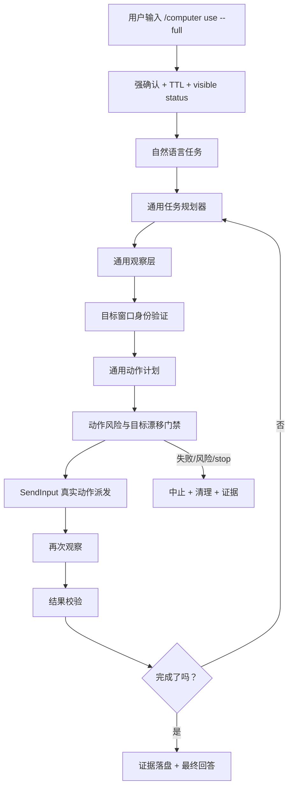

# Universal Real GUI Computer Use Blueprint

## 1. 蓝图定位

本蓝图的目标，是把 `learning_agent` 的 `/computer use --full` 从当前的 recording-mode 桌面任务证据链，升级为一个真正能控制本机普通 Windows 应用的通用 GUI 闭环。

这里的“通用”不是“每个应用写一个控制器”，也不是“把所有安全边界取消”。这里的“通用”指：同一套观察、定位、动作、校验、恢复机制，可以作用于普通本机应用。Paint、Notepad、Calculator、浏览器窗口只能作为代表性验收样本，不能成为专用代码路径。

本蓝图必须替代逐应用白名单、逐应用 patch、逐应用 controller 的设计方向。以后如果某个任务需要为一个应用写专用 controller，默认视为架构失败，必须先回到通用观察和通用动作层修能力。

## 2. 当前事实

当前项目已经完成了这些基础能力：

- `/computer use --full` 的强确认、TTL、stop、status、权限状态和可见终端验收链路已经存在。
- Phase92/93 已经确立了单一通用运行时方向：observe -> plan -> act -> verify。
- 通用窗口发现、窗口身份、目标漂移阻断、自有资源清理、动作锁、abort、SendInput 合同、UIA/截图/OCR 预留层已经有雏形。
- Paint/Pikachu 自然语言 prompt 已经能进入 Computer Use runtime，不再走脚本生成图片文件路线。
- 当前最终矩阵明确写着 `maturity_known_limit_real_desktop_execution=false`，表示真实无约束桌面执行还没有成熟。

当前最大缺口不是“不会控制 Paint”，而是：真实 GUI 闭环还没有完成从观察到真实动作再到视觉校验的通用执行闭合。

## 3. 核心原则

### 3.1 禁止逐应用控制器

禁止新增这些设计：

- `PaintController`
- `NotepadController`
- `ChromeController`
- `if app == "mspaint"` 后走特定逻辑
- 为某个应用硬编码按钮坐标、菜单路径、窗口标题模板
- 为最终效果生成 PNG/SVG/JPG 后打开文件冒充 GUI 操作

允许存在的是代表性验收样本，例如 Paint 画皮卡丘、Notepad 输入文字、Calculator 做简单计算。但这些样本必须调用同一个通用 GUI 内核。

### 3.2 代表性应用只用于验收

Paint/Pikachu 的作用是证明通用内核具备这些能力：

- 能打开或聚焦一个普通 Windows 应用。
- 能观察窗口和画布区域。
- 能执行通用鼠标拖拽。
- 能通过截图或像素变化判断任务是否真的发生。
- 能在失败时 stop、清理、输出证据。

如果 Paint 场景通过了，但代码里出现 Paint 专用路径，则验收无效。

### 3.3 无逐应用白名单，不等于无安全边界

成熟目标是“无逐应用白名单、无逐应用 controller”。不是允许 agent 随便控制终端、密码窗口、支付页面、管理员设置、系统安全界面。

风险边界仍必须存在：

- 普通用户应用：强确认 full mode 后可进入真实 GUI 闭环。
- 终端、管理员、安全软件、密码、支付、登录、验证码、系统设置：默认拒绝或进入更高风险人工确认，不属于本阶段成熟范围。
- 任何动作前必须确认目标窗口仍是授权目标。
- 任何动作前必须检查 abort/stop。

## 4. 成熟目标

最终成熟状态应输出类似字段：

```text
UNIVERSAL_REAL_GUI_COMPUTER_USE_READY
single_universal_real_gui_loop=true
per_app_controller_required=false
hardcoded_app_whitelist_required=false
ordinary_apps_controlled_by_generic_runtime=true
representative_apps_are_acceptance_only=true
real_window_observation=true
real_uia_or_vision_targeting=true
real_sendinput_dispatch=true
target_identity_rechecked_before_each_action=true
observe_plan_act_verify_loop=true
paint_pikachu_real_acceptance=true
notepad_real_acceptance=true
calculator_real_acceptance=true
browser_real_acceptance=true
script_artifact_route_blocked=true
real_desktop_execution_mature=true
uncontrolled_high_risk_actions_allowed=false
```

这些字段必须来自可运行代码和真实可见终端验收，不允许只靠文档声明。

## 5. 总体架构



## 6. 组件蓝图

### 6.1 Universal Real GUI Session

职责：

- 管理 `/computer use --full` 的真实 GUI session。
- 保存 session id、确认 token、TTL、模式状态、授权目标、当前任务、stop 状态。
- 每个真实动作必须绑定 session id。

成功标准：

- 未开启 full mode 时，真实动作事件数必须为 0。
- full mode 过期或 stop 后，真实动作事件数必须为 0。
- 每次真实动作都能追溯到同一个 session audit。

### 6.2 Real Observation Layer

职责：

- 获取真实窗口列表。
- 获取活动窗口。
- 截取目标窗口或屏幕区域。
- 获取 UI Automation 树。
- 可选接入 OCR 和视觉检测。
- 统一输出一个 `ObservationFrame`，供规划器和校验器使用。

要求：

- 不保存敏感原文，只保存脱敏摘要、截图路径、控件 bounds、窗口身份。
- 支持 DPI、多显示器、窗口缩放。
- 支持截图非空像素检查，避免黑屏或空图也被当成观察成功。

### 6.3 Generic Target Resolver

职责：

- 从用户 prompt 中识别目标应用或当前目标窗口。
- 通过 Windows Start Menu、已安装应用、窗口列表、Shell AppUserModelId 等通用来源解析目标。
- 启动普通应用或聚焦用户授权的已有窗口。
- 记录 pre-launch baseline，避免误把用户原有窗口当成 agent 控制目标。

禁止：

- 不能靠固定 `mspaint.exe` 白名单证明通用性。
- 不能为每个应用写硬编码启动规则。

允许：

- 使用 Windows 的通用应用发现机制。
- 使用用户 prompt 里的应用名作为搜索词。
- 使用代表性应用作为验收样本。

### 6.4 Target Identity Guard

职责：

- 记录目标窗口身份：pid、hwnd、process name、process path hash、title hash、bounds。
- 动作前重新观察当前窗口。
- 对比目标是否漂移。
- 漂移时拒绝动作，事件数为 0。

成功标准：

- 目标窗口被其它窗口覆盖或焦点漂移时，不允许继续点击。
- 用户原有窗口不能被误当成 agent 自己启动的目标。
- 清理时只关闭 agent 自己启动或明确授权的窗口。

### 6.5 Generic Action DSL

职责：

定义一套不依赖具体应用的动作语言：

- `focus_window`
- `click_point`
- `double_click_point`
- `drag_path`
- `type_text`
- `press_key`
- `hotkey`
- `scroll`
- `wait`
- `observe`
- `verify_visual_change`
- `verify_text_or_control`

这些动作只引用：

- 目标窗口
- 控件 bounds
- 屏幕坐标
- 窗口相对坐标
- 观察帧中的 UIA 节点或视觉区域

不允许引用：

- 应用专用类名逻辑
- 应用专用菜单脚本
- 应用专用绝对坐标

### 6.6 Real SendInput Dispatcher

职责：

- 把 Generic Action DSL 转成真实 Windows 输入事件。
- 支持鼠标移动、点击、拖拽、键盘输入、快捷键、滚轮。
- 每个低层事件前检查 stop/abort。
- 每个低层事件写入 audit。
- 执行后立即触发观察。

成功标准：

- `drag_path` 能真实移动鼠标并拖拽。
- `type_text` 默认脱敏记录，只保存长度和 hash。
- stop 后不会继续发送剩余事件。
- 真实动作必须持有桌面控制锁。

### 6.7 Universal Planner

职责：

- 把自然语言任务拆成通用 GUI 动作步骤。
- 根据观察帧决定下一步，不盲目执行长动作序列。
- 失败时重新观察并修正计划。
- 高风险任务进入拒绝或更高确认。

Paint/Pikachu 场景中，planner 可以生成“绘制一个简单皮卡丘”的图形意图，再由通用 `drag_path` primitive 执行。这里允许有“绘图 primitive”，但不允许有“Paint 专用 controller”。

### 6.8 Verify Loop

职责：

- 动作后截图。
- 对比动作前后像素变化。
- 检查目标窗口仍然存在。
- 检查 UIA 或视觉目标是否达到任务条件。
- 失败时给出下一步或停止。

Paint/Pikachu 验收必须至少证明：

- 真实 Paint 窗口出现。
- 真实画布区域被定位。
- 真实鼠标拖拽事件数大于 0。
- 动作后画布像素发生变化。
- 没有生成图片文件冒充最终结果。
- 证据截图可打开且非空。

## 7. 分阶段路线

### URG-1：真实观察闭环

目标：

- 建立真实 `ObservationFrame`。
- 截图、窗口、UIA、DPI、多显示器基础信息统一落盘。

验收：

- `/computer observe` 在真实可见终端中能输出目标窗口截图证据。
- 截图非空，bounds 正确，UIA 或视觉摘要可用。
- 事件数为 0，不触碰鼠标键盘。

### URG-2：真实目标窗口 session

目标：

- full mode 下通过通用 resolver 启动或聚焦普通应用。
- 建立目标身份。
- 动作前目标重验。

验收：

- Notepad、Paint、Calculator 作为代表性样本都能被通用 resolver 启动或聚焦。
- 无应用专用 controller。
- 目标漂移时拒绝动作。

### URG-3：真实 SendInput 最小闭环

目标：

- 在已验证目标窗口内执行最小真实动作。
- 支持 click、type、hotkey、drag。

验收：

- Notepad 真实输入固定验收文本。
- Calculator 真实点击或键入简单表达式。
- Paint 真实执行一条短拖拽线。
- stop/abort 能中断动作序列。

### URG-4：通用 observe-plan-act-verify loop

目标：

- 不再只执行预写动作。
- 每步动作前后都观察和校验。
- planner 根据观察结果继续、重试或停止。

验收：

- 同一 loop 完成 Notepad、Calculator、Paint 三个代表性任务。
- 代码层无 `if app == ...` 的专用执行分支。

### URG-5：Paint/Pikachu 真实代表性验收

目标：

- 用户通过真实可见终端输入：

```text
/computer use --full
请使用本地电脑的画图软件画一个皮卡丘。
```

- agent 用通用 GUI 内核真实打开或聚焦 Paint，定位画布，拖拽绘制，截图校验。

验收：

- `paint_is_acceptance_only=true`
- `per_app_controller_required=false`
- `real_paint_window_verified=true`
- `real_canvas_region_detected=true`
- `real_drag_path_dispatched=true`
- `canvas_changed_after_real_actions=true`
- `script_artifact_route_blocked=true`
- `generated_image_file_used=false`
- `real_desktop_execution_mature=true`

### URG-6：跨应用成熟矩阵

目标：

- 把所有代表性验收和通用架构事实收敛到最终矩阵。

最低样本：

- Paint：真实拖拽绘图。
- Notepad：真实文本输入和保存/不保存边界。
- Calculator：真实按钮或键盘输入。
- Browser 或普通第三方应用：真实点击和观察。

通过条件：

- 代表性样本全部走同一通用内核。
- 没有逐应用 controller。
- 没有硬编码应用白名单。
- 高风险目标仍拒绝。
- stop 后没有残留动作。

## 8. 验收门禁

每个阶段必须同时满足：

- 单元测试通过。
- 相邻 Computer Use 回归通过。
- `py_compile` 通过。
- 真实可见终端验收通过。
- 证据文件落盘。
- `agent_memory/progress.md` 更新边界和结论。
- 修改内容备份到 `learning_agent/test/...`。

最终阶段必须使用：

```powershell
powershell.exe -NoProfile -ExecutionPolicy Bypass -File .\learning_agent\acceptance_controller\controller.ps1 -ScenarioPath "<final-universal-real-gui-scenario.json>"
```

而不是用管道输入、只看日志、selftest 或纯单元测试替代。

## 9. 失败定义

出现以下任一情况，不能宣称成熟：

- 只生成图片文件，然后打开 Paint。
- 只输出 recording-mode 证据，没有真实鼠标键盘动作。
- 只有 Paint 通过，其它普通应用不能复用同一内核。
- 代码中出现 Paint/Notepad/Calculator 专用 controller。
- 真实动作没有目标窗口重验。
- stop 后仍继续发送事件。
- 截图为空或无法打开。
- 只靠最终文本声称成功，没有动作前后证据。

## 10. 停止条件

如果以下问题连续阻塞，应停止并汇报治本方案，不继续堆 phase：

- Windows 截图能力不可靠。
- UIA 树不可用且没有视觉/OCR fallback。
- SendInput 无法稳定落到目标窗口。
- DPI/多显示器坐标无法统一。
- 目标身份重验无法防止动作漂移。
- 真实终端验收无法观察或输入。

## 11. 推荐下一步

下一步不是写 Paint 代码，而是执行 URG-1：

**实现真实 ObservationFrame，并用真实可见终端证明它能稳定观察本机普通应用窗口。**

完成 URG-1 后，再进入 URG-2 目标窗口 session。只有观察和目标身份先成熟，真实动作才不会变成乱点本机桌面的危险能力。

