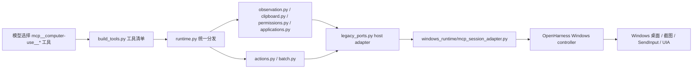

# inferred_ant_mcp 反推包说明

这个目录是 OpenHarness 为了对齐 ClaudeCode Computer Use 外部 MCP 包而建立的“反推实现层”。它对应的是 ClaudeCode 里观察到的 `@ant/computer-use-mcp` 风格工具面和调用合同，不是 ClaudeCode 的 macOS native package 源码，也不是 Windows 底层执行器本身。

用户已确认的边界是：ClaudeCode 走 macOS native package，OpenHarness 走 Windows in-tree runtime，所以底层接口天然不同，不能要求代码级完全一致。除此之外，本目录的目标是尽量把模型可见工具名、参数 schema、只读/动作语义、错误返回、观察数据、图片结果和批量调用约束补齐到 ClaudeCode 可观察行为。

## 本目录负责什么

- 定义 `computer-use` MCP server 的模型可见工具清单。
- 拦截旧 Computer Use 聚合工具名、shell 工具名和文件工具名，避免它们绕过新的原子工具面。
- 把 `observe`、`screenshot`、`zoom` 归为只读观察语义。
- 把鼠标、键盘、剪贴板、应用启动、授权、等待、批量动作拆成 ClaudeCode 风格原子工具。
- 在没有 Windows host 绑定时返回明确失败，避免“看起来成功但实际没动桌面”的假成功。
- 通过 host adapter 接到 OpenHarness 已有 Windows controller、截图证据链、SendInput 执行链和 agent 事件记录链。

## 本目录不负责什么

- 不直接调用 Win32、UIA、SendInput 或截图 API。
- 不打开真实窗口，不注入真实键鼠事件。
- 不提供 bash、PowerShell、read/write/edit 等命令或文件工具。
- 不替代 `windows_runtime`，只定义并调度上层 MCP 合同。
- 不伪装成 ClaudeCode 的 macOS native package 源码。

## 总链路



运行时入口有两类：

- stdio MCP server 入口：对外暴露 `computer-use` 工具清单，最终调用 `dispatch_computer_use_mcp_v2_tool(...)`。
- agent-side 入口：`bind_session_context.py` 绑定当前 agent 的 controller、权限回调、观察记录和 trace 回调，然后同样进入 `dispatch_computer_use_mcp_v2_tool(...)`。

## 模型可见工具面

当前公开工具名以 `build_tools.py` 的 `COMPUTER_USE_MCP_TOOL_NAMES` 为准：

```text
request_access
observe
screenshot
cursor_position
mouse_move
left_click
double_click
right_click
middle_click
triple_click
left_mouse_down
left_mouse_up
type
key
hold_key
scroll
left_click_drag
zoom
wait
read_clipboard
write_clipboard
open_application
list_granted_applications
computer_batch
```

其中 `observe`、`screenshot`、`zoom`、`wait`、`read_clipboard`、`list_granted_applications` 是只读工具；鼠标、键盘、写剪贴板和应用启动是可能改变桌面的动作工具。

## 关键文件职责

| 文件 | 职责 |
| --- | --- |
| `build_tools.py` | 定义唯一模型可见工具清单、JSON schema、只读/破坏性标记、禁止旧名和 shell 名。 |
| `runtime.py` | 统一清洗工具名、检查白名单、按工具类型分发到授权、观察、动作、剪贴板、应用、批量模块。 |
| `types.py` | 定义 `ComputerUseMcpV2Context`，保存 host、授权回调、观察记录、trace、验收事件、授权状态和剪贴板状态。 |
| `observation.py` | 执行 `observe`、`screenshot`、`zoom` 的只读观察语义，并把观察 payload 写回 agent。 |
| `actions.py` | 执行鼠标、键盘和光标类原子动作；无 host 时动作失败，不再假成功。 |
| `batch.py` | 顺序执行 `computer_batch`，禁止旧聚合名、shell 名和文件名通过 batch 后门进入。 |
| `permissions.py` | 处理 `request_access` 和 `list_granted_applications` 的授权状态。 |
| `clipboard.py` | 处理受控内存剪贴板读写，保持 MCP 层最小闭环。 |
| `applications.py` | 处理 `open_application`，把应用启动请求交给 host。 |
| `legacy_ports.py` | 把 v2 原子工具桥接到 OpenHarness 已有 Windows session adapter；这是反推包和 Windows runtime 的主要边界。 |
| `bind_session_context.py` | 在 agent 运行时构造带 host、回调和状态的 v2 context。 |
| `result_blocks.py` | 统一 `success_result`、`error_result` 和模型可读结果块格式。 |
| `errors.py` | 生成稳定错误结构，方便测试和上层恢复。 |
| `coordinates.py` | 放置坐标数据转换辅助逻辑。 |
| `telemetry.py` | 记录工具调用 trace，辅助长任务审计。 |
| `sentinel_apps.py` | 保存应用识别和受控应用边界相关辅助数据。 |
| `__init__.py` | 标记包边界，方便外部按包导入。 |

## host adapter 合同

`inferred_ant_mcp` 本身不执行 Windows 动作，它只期待 `context.host` 提供这些能力：

- `observe(arguments)`：返回当前桌面观察结果。
- `zoom(arguments)`：返回局部观察结果；OpenHarness 当前通过观察截图加裁剪实现模型可见 zoom 图。
- `cursor_position()`：返回当前指针位置。
- `mouse_move(arguments)`、`left_click(arguments)`、`double_click(arguments)`、`right_click(arguments)`、`middle_click(arguments)`、`triple_click(arguments)`。
- `left_mouse_down(arguments)`、`left_mouse_up(arguments)`、`left_click_drag(arguments)`。
- `type(arguments)`、`key(arguments)`、`hold_key(arguments)`、`scroll(arguments)`。
- `open_application(app_name, arguments)`。

OpenHarness 的真实 host 由 `legacy_ports.py` 创建，内部再调用 `windows_runtime/mcp_session_adapter.py`。这样做的原因是：反推包保持 ClaudeCode 外部包合同；Windows 真实执行能力集中留在 OpenHarness 自己的 runtime 里。

## zoom 的特殊语义

`zoom` 在 ClaudeCode 对齐语义里是观察工具，不是鼠标键盘动作。当前实现遵循三条规则：

- `runtime.py` 把 `zoom` 和 `observe`、`screenshot` 放在同一条只读观察分支。
- `observation.py` 对 `zoom` 调用 `host.zoom(arguments)`，没有 host 时返回 `zoom_unavailable_without_host`。
- `windows_runtime/mcp_session_adapter.py` 在 host 层复用截图证据链，并尝试按窗口坐标映射裁剪出局部 PNG，再把裁剪图写成模型可重新注入的 `image_result`。

如果源截图、窗口 rect 或坐标映射不足，zoom 会返回明确失败原因；它不会把一次失败伪装成已经放大成功。

## 与 ClaudeCode 的对齐结论

已经对齐的部分：

- 模型可见工具从旧聚合工具收敛为 `mcp__computer-use__*` 原子工具。
- 新增并接通 ClaudeCode 可观察工具：`middle_click`、`triple_click`、`left_mouse_down`、`left_mouse_up`、`hold_key`、`left_click_drag`、`zoom`。
- 禁止 shell、文件、旧聚合 Computer Use 工具混入 Computer Use MCP。
- 写动作无 Windows host 时返回失败，不再 no-op 假成功。
- `hold_key` 有按键释放清理和批量错误传播测试。
- `observe`、`screenshot` 和 `zoom` 保持图片 artifact 证据链。
- `zoom` 现在返回模型可见的局部裁剪图，而不是只返回整张截图。

不能代码级对齐的部分：

- ClaudeCode 底层是 macOS native package；OpenHarness 底层是 Windows in-tree runtime。
- ClaudeCode 外部包真实内部实现不可直接证明，本目录只能按源码观察到的工具面、数据合同和行为结果反推。

仍可继续提升的部分：

- 给真实 Windows 终端场景补更多可视化回归用例，比如“打开记事本、输入、局部 zoom 检查文字”。
- 当真实窗口观察结果缺少 rect 时，给 `zoom` 增加从 session 状态或 controller active window 兜底取 rect 的路径。
- 如果未来拿到真实 `@ant/computer-use-mcp` 包版本，可以用本 README 的工具面和返回结构逐项 diff。

## 主要测试覆盖

- `learning_agent/tests/test_computer_use_tool_scope.py`
- `learning_agent/tests/test_computer_use_mcp_v2_contract.py`
- `learning_agent/tests/test_computer_use_mcp_session_adapter.py`
- `learning_agent/tests/test_computer_use_mcp_v2_sendinput_parity_task4.py`
- `learning_agent/tests/test_windows_computer_use_image_results_phase41.py`
- `learning_agent/tests/test_windows_computer_use_real_screenshot_phase56.py`

这些测试覆盖工具面白名单、旧名拦截、shell 禁止、host 缺失失败、Windows adapter 映射、SendInput parity、截图 artifact、坐标缩放和 zoom 图片结果。
