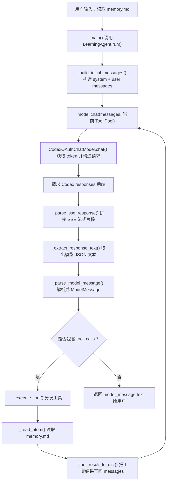

# Learning Agent：成熟 coding agent 学习与演进版

这个文件夹是一个面向学习和二次开发的 coding agent 项目。它最初从最小私人 agent 起步，现在目标是逐步升级成更接近 Codex / Claude Code 的成熟 agent：能理解项目上下文、选择合适工具、维护任务进度、调用 MCP 外部能力、验证结果，并用中文把关键步骤解释给代码小白和 agent 小白。

它不只是演示“模型调用 + tool loop”的基础概念，也开始强调成熟 agent 更重要的部分：

- Prompt / Context Architecture：系统提示词、运行时规则和 `memory.md` 长期记忆如何进入模型上下文。
- 工具调用：模型只负责决定是否调用工具，Python 工具层负责真实读写文件、执行命令、联网或调用 MCP。
- 上下文管理：目标 agent 每轮只默认读取 `memory.md`；Codex 开发本项目用的 `agent_memory` 三件套不再关联到目标 agent 的 system prompt。
- 权限确认：写文件、命令执行、删除、外部访问等副作用操作需要尊重工具层权限边界。
- 验证：完成代码任务前尽量运行测试或检查，无法验证时明确说明残余风险。
- 中文解释：面向初学者解释关键原因，但不让教学性压过工程可靠性。

## ClaudeCode / Codex agent core 对齐状态

## Stage 15 Event Runtime / Tool Executor v2

截至 2026-05-31，`learning_agent` 已新增一层更接近成熟 agent 的运行时骨架：

- `core/events.py` 定义统一 `AgentEvent`，用于记录 run、model、tool、permission、session 等事件。
- `observability/transcript.py` 负责把事件写入 `memory/sessions/<session_id>/events.jsonl`，并支持把 JSONL 读回事件对象。
- `models/base.py` 新增 `ModelStreamEvent` 和 `stream_chat_events()`，旧 `chat()` 模型会自动包装成一次性完成事件。
- `core/agent.py` 新增 `run_events()`，会 yield 事件并写 transcript；旧 `run()` 仍保持字符串返回兼容。
- `tools/types.py` 的 `AgentTool` 新增并发、权限、交互、结果策略和超时元数据。
- `tools/executor.py` 已升级为 Tool Executor v2：统一权限决策、pre/post hook、permission_denied、tool_error observation。
- `tools/orchestrator.py` 只会并发执行连续的、明确只读且 `is_concurrency_safe=True` 的工具；写入、命令、浏览器副作用和未知工具默认串行。
- `core/session.py` 提供 `SessionStore`、`SessionRecord` 和最小 compact helper；summary 不删除原始 transcript。

这一步的意义是：agent 不再只是“模型说完 -> 逐个工具执行 -> 最终回答”，而是开始拥有可观察、可恢复、可审计、可并发扩展的运行时骨架。

## Prompt Architecture v1

Prompt Architecture v1 是当前 Tool parity 之后的 beyond-parity control layer。Tool parity 已经在公开可复现的 core 层完成：Tool Catalog、Tool Pool、ToolPolicy、四原子首轮工具面、per-tool output protocol、MCP lifecycle、Real Chrome workflow gate、Plan mode guard、Observation 和长工具结果落盘都已经有可运行实现和回归测试。

Prompt Registry 负责把系统提示词、动态运行规则索引和 `memory.md` 长记忆索引登记成带 metadata 的 prompt blocks；Context Assembler 负责按 priority 和 token budget 把本轮真正需要的 blocks 组装成 system prompt。

Prompt Surface Report 对应 `prompt_surface_report` 工具，用来说明本轮加载了什么、为什么加载、来源是什么、哪些内容只是 indexed、哪些内容被 compact 或截断。Token Budget Report 对应 `token_budget_report` 工具，用来说明 prompt、tool 和 context 预算，尤其是 Prompt blocks、Current Tool Pool 和 estimated_total_tokens。

long memory 和 project files 默认只进入索引，不默认全文塞进模型上下文；需要全文时必须在当前轮显式 read。历史设计文档、旧计划和旧 checklist 也不会自动影响模型，除非当前轮显式读取。Compact Summary 负责压缩过长上下文并保留来源边界；Evidence Ledger bridge 负责把 observation events 变成可审计证据，两者不能混用。

Prompt compact 的生产软预算默认约为 60,000 tokens。只允许 `cache_policy="dynamic"` 且非 `built_in` 的动态上下文块被 compact，内置身份、工具边界、回复策略等核心规则即使预算紧张也保持完整加载。需要临时调整预算时，可以在 `runtime_config.json` 写入 `prompt_soft_token_limit`，或设置环境变量 `LEARNING_AGENT_PROMPT_SOFT_TOKEN_LIMIT`。

截至 2026-05-26，learning_agent 的目标已经从“补单个工具”升级为“追平成熟 agent 的顶层结构”。当前已经完成的核心结构包括：

- Tool Catalog / Tool Pool / Tool Policy 分层：完整工具目录仍由 Python 内部保存，但模型首轮 Tool Pool 只暴露 `read / write / edit / bash` 四个原子工具；其他能力通过 `learning_agent/skills/tool_list.md` -> `SKILL.md` -> `rules/*.md` 三级动态规则树按需读取后再执行。
- per-tool output protocol：每个 `tool_call.name` 绑定自己的 `arguments` schema，避免把真实 Chrome 的 `confirm_real_profile` 串到 `browser_open` 这类其他工具里。
- MCP lifecycle：支持捕获 stdio / HTTP SSE 的 `tools/list_changed`、`prompts/list_changed`、`resources/list_changed` 通知，并刷新 registry / catalog。
- MCP call progress 与 observation：MCP 工具调用会记录权限请求、开始、完成、失败，长工具结果会保存到 `learning_agent/debug_logs/tool_results/`，模型上下文只回填摘要。
- 真实 Chrome workflow gate：用户明确要求真实 Chrome、桌面 Chrome、桌面可见浏览器、当前浏览器或登录态时，会先要求 `browser_profile_status`，再允许 `browser_connect_real_chrome`，连接成功前会阻断普通独立 Chromium 动作。
- Plan mode / Worktree / Task hardening：计划确认前执行层会阻断写入、删除、命令、外部操作等副作用工具；worktree 当前是明确标注的 `state_only_fallback` 状态隔离，尚不创建真实 git worktree；子 agent 会继承父 agent 的 ToolPolicy 上下文。

因此，这个项目可以诚实地说：**agent core 的工具架构、权限策略、MCP 生命周期、输出协议、真实 Chrome workflow、计划模式和 observation 骨架已基本追平 ClaudeCode 的公开可复现核心思路**。它仍不声称复制 ClaudeCode 的私有产品能力，例如内部 ant-only 工具、商业远程协作、PushNotification、SubscribePR、RemoteTrigger、私有 feature flag 或完整图形产品面板。

## 文件说明

- `learning_agent.py`：脚本启动入口，只负责路径兜底并调用 `app.cli.main()`；如果这里重新堆业务逻辑，后续排查会再次变回巨型文件模式。
- `core/agent.py`：主 agent 类、tool loop、兼容导出和终端权限入口的核心实现；如果要看 `LearningAgent.run()`、`TOOL_SCHEMAS` 或工具路由，优先从这里进入。
- `app/`：CLI、doctor、HTTP command bridge 和真实终端交互入口；如果启动命令、`run --json`、bridge 或 `mcp-doctor` 出问题，优先看这一层。
- `browser/`：真实浏览器意图、自然查询 harness、客户模式授权、Google 查询白名单和截图路径 helper；如果真实 Chrome 查询或免多次 `y/N` 出问题，优先看这一层。
- `observability/`：调试日志、验收事件、权限事件和最终回答事件；如果 acceptance controller 或真实可见终端验收判断异常，优先看这一层。
- `tests/`：唯一模块化测试入口；如果只想跑某一层回归，优先从 `tests/test_*.py` 进入，完整回归统一使用 `python -m unittest discover learning_agent`。
- `memory.md`：长期记忆文件。
- `staticprompt/staticprompt.md`：每轮常驻加载的静态系统提示词，用户可直接编辑核心身份、行为原则、上下文策略和动态规则路由。
- `dynamicprompt/dynamicprompt.md`：按需加载的动态运行规则索引，不再每轮进入 system prompt；需要具体流程时先用 `read` 读取 `learning_agent/skills/tool_list.md`，再读取对应 `SKILL.md`，只有确实需要细节时才继续读取该 skill 的 `rules/*.md`。
- `browser_profiles.example.json`：真实 Chrome profile 高风险模式的本机配置示例，复制为 `browser_profiles.json` 后再按自己的机器路径修改。
- `AGENT_ARCHITECTURE_INDEX.md`：Stage 14 纯新架构索引；改代码前先看它，可以更快判断问题属于入口层、模型层、工具层、MCP 层、浏览器层、权限层、观测层还是测试层。
- `__init__.py`：让这个文件夹可以作为 Python 包导入。
- `start_codex_agent.bat`：双击启动 Codex/GPT-5.5 真实模型版本。
- `start_codex_agent.ps1`：Codex/GPT-5.5 启动脚本的 PowerShell 实现。
- `start_oauth_agent.bat`：新增代码：双击启动 OpenAI OAuth/API 直连版本。
- `start_oauth_agent.ps1`：新增代码：OAuth/API 直连启动脚本的 PowerShell 实现。

## 工作原理

```text
用户输入
  ↓
读取 staticprompt.md 与 memory.md，按需加载 dynamicprompt.md / skills/tool_list.md / SKILL.md / rules 子规则
  ↓
把静态 system prompt + memory.md 索引 + 用户输入发给模型
  ↓
模型选择直接回答，或请求工具调用
  ↓
agent 执行工具
  ↓
写文件和写 memory 前先问用户确认
  ↓
工具结果再喂回模型
  ↓
模型输出最终回答
```

### 完整 tool loop 示例：读取 memory.md

下面用一句真实用户输入串起整条 agent 链路：

```text
请调用 read 工具读取 memory.md，然后总结里面有什么。
```

第一步，终端入口 `main()` 会把用户输入交给 `LearningAgent.run()`。

第二步，`run()` 调用 `_build_initial_messages()`，生成本轮初始 `messages`。这里面包含系统提示词、当前工作区、`memory.md` 的长期记忆内容，以及用户刚刚输入的问题。

第三步，`run()` 调用 `self.model.chat(messages, 当前 Tool Pool)`。其中 `messages` 是当前对话历史，当前首轮 Tool Pool 默认只包含 `read / write / edit / bash` 四个原子工具的说明书。

第四步，如果当前使用 OAuth/API 直连模式，调用会进入 `CodexOAuthChatModel.chat()`。它会先通过 `_get_valid_tokens()` 获取可用 token，再通过 `_build_headers()` 构造鉴权请求头，最后通过 `_build_responses_body()` 构造 Codex 后端需要的请求体。

第五步，请求会发往：

```text
https://chatgpt.com/backend-api/codex/responses
```

因为请求体里设置了 `stream: true`，后端会返回 SSE 流式片段。`_parse_sse_response()` 会把这些片段拼成 `output_text`，`_extract_response_text()` 会取出模型最终输出的 JSON 文本。

第六步，`CodexCliChatModel._parse_model_message()` 会把 JSON 文本解析成 `ModelMessage`。如果模型决定调用工具，里面会包含类似这样的 `ToolCall`：

```text
ToolCall(name="read", arguments={"path": "memory.md"})
```

第七步，`run()` 看到 `tool_calls` 不为空，就调用 `_execute_tool()`。`_execute_tool()` 根据工具名分发到 `_read_atom()`，由 Python 工具层真正读取 `memory.md`。模型本身不直接读文件。

第八步，工具结果会通过 `_tool_result_to_dict()` 追加回 `messages`。下一轮模型调用时，模型就能看到 `memory.md` 的真实内容。

第九步，模型根据工具返回内容生成最终回答，并返回一个没有 `tool_calls` 的 `ModelMessage`。`run()` 看到没有工具调用后，就把 `model_message.text` 返回给用户。

可以把这条链路记成一句话：

```text
模型负责决定要不要调用工具；Python 负责真实执行工具；messages 负责把工具结果带回下一轮模型。
```

下面是同一条链路的流程图：



## 调试日志

现在 agent 每处理一次用户输入，都会自动写入三份调试日志：

```text
learning_agent\debug_logs\agent_debug.jsonl
```

这是机器日志，一行一个 JSON 事件，适合以后写程序分析。

```text
learning_agent\debug_logs\agent_debug_readable.md
```

这是追加版 Markdown 可读日志，会保留所有历史运行记录。

```text
learning_agent\debug_logs\latest_run_readable.md
```

这是最新一轮 Markdown 可读日志，每次新输入都会被重置，只保留最近一次运行，最适合用 Windows 记事本打开学习。

Markdown 可读日志常见区块包括：

- `user_input`：用户输入了什么。
- `initial_messages`：本轮开始时模型看到的初始 messages 和工具名。
- `model_request`：每次调用模型前发送给模型的上下文。
- `model_response`：模型返回的决策说明、文本或工具调用。
- `tool_call`：模型请求调用哪个工具、参数是什么。
- `tool_result`：Python 工具层实际执行后的结果。
- `final_answer`：最终返回给用户的回答。
- `safety_stop`：达到最大工具循环次数时的安全停止记录。

其中 `模型决策说明` 是模型用一句话解释“为什么直接回答”或“为什么选择某个工具”。它是给学习者看的行动说明，不是模型隐藏思维链。

注意：调试日志会记录本地 messages、系统提示词、memory 内容、工具结果和模型决策说明，适合学习和排查，但不要把包含隐私内容的日志上传到公开仓库。

## 配置真实模型：官方 API key 方式

这个教学版默认使用 OpenAI-compatible 接口。你需要先配置环境变量：

```powershell
$env:OPENAI_API_KEY="你的 API key"
$env:OPENAI_MODEL="gpt-4o-mini"
```

如果你使用 OpenRouter、DeepSeek、Ollama、DashScope 等兼容接口，可以额外设置：

```powershell
$env:OPENAI_BASE_URL="你的兼容接口地址"
```

## 为什么先接 MCP，再接浏览器

如果把 Playwright 直接写进 `learning_agent.py`，短期看起来最快，但缺点也很明显：浏览器启动、页面点击、权限确认、错误恢复和依赖安装都会挤进 agent 核心文件，初学者会很难看清真正的主线。更麻烦的是，后面如果再接搜索、数据库、GitHub 或其他外部能力，每一种工具都要在核心文件里重复写一套连接和权限逻辑，项目会越来越像工具杂烩，而不是一个清楚的 agent 教学骨架。

Codex / Claude Code 这类 agent 的核心不是某一个具体浏览器库，而是模型调用、tool loop、权限确认和上下文管理。具体工具应该通过统一的 MCP 接入：模型先看到有哪些工具，决定是否调用；工具层再等待权限确认；确认后才真正执行浏览器、搜索、数据库或 GitHub 操作。这样学习者能先理解 agent 的骨架，再把外部能力一块一块接上去。

MCP 只是把浏览器等外部工具接到 agent 工具层，模型本身仍然不能直接操作网页。模型只能请求工具；真正点击页面、读取网页内容或执行浏览器动作的是 MCP server 和工具层，并且这些外部操作仍然受权限确认约束。

推荐路线图是：

```text
learning_agent 核心
  -> MCP tools/list
  -> MCP tools/call
  -> browser_automation MCP（本地 Python Playwright Chromium）
```

项目里提供了示例配置：

```text
learning_agent\mcp_servers.example.json
```

`mcp_servers.example.json` 只是给你看的模板，本身不会被自动读取，也不会自动启用 MCP。

使用时可以先把它复制为：

```text
learning_agent\mcp_servers.json
```

只有复制或另存为 `learning_agent\mcp_servers.json` 后，learning_agent 才会把它当作真实 MCP 配置读取。然后再按需要启用里面的 MCP server。当前真实浏览器路线默认仍是本地 Python 版 `browser_automation` MCP server，它优先使用 Playwright 启动独立 Chromium；首次使用前需要安装 Python `playwright` 包并执行 `python -m playwright install chromium`。如果用户明确要求复用真实 Chrome 登录态，现在也可以通过可选高风险模式连接用户日常 Chrome profile，但它不是默认启用。启动外部 MCP server 会请求权限；模型调用 MCP 工具时也会请求权限。如果用户拒绝，agent 应该尊重拒绝结果，不要假装工具已经执行，也不要反复强行请求同一个外部工具操作。

现在 `mcp_servers.json` 支持三种 `transport` 写法。旧配置不写 `transport` 时默认还是 `stdio`，继续使用 `command` 和 `args` 启动本地 MCP server。远程 MCP server 优先写 `transport: "http"`，并提供 `url`，需要鉴权时再写 `headers`。例如：

```json
{
  "servers": [
    {
      "name": "remote_docs",
      "transport": "http",
      "url": "https://example.com/mcp",
      "headers": {
        "Authorization": "Bearer your-token"
      }
    }
  ]
}
```

这里的 HTTP 指 MCP 当前推荐的 Streamable HTTP endpoint。旧的 SSE / HTTP+SSE 可以在配置里写 `transport: "sse"`，但当前最小版只会给出清楚的“暂未实现，请优先改用 transport=http”提示，不会假装已经完整支持旧 SSE 双端点协议。

### MCP HTTP session / stream lifecycle

当前 Streamable HTTP transport 已经支持基础 session / stream lifecycle。普通 JSON-RPC `POST` 不只会解析 JSON 响应，也可以解析 `text/event-stream` 响应，把 SSE 里的 JSON-RPC result 取出来继续交给 tool loop。

如果需要读取 server 主动发来的通知，可以通过 `listen_mcp_stream` 发起有界 `GET` 读取 SSE 事件。这里的“有界”指调用时必须给出 `server`、`max_events` 和 `timeout_seconds`，到达事件数量或超时就返回；它不是后台常驻监听，不会替代完整 OAuth 登录流程，也不会把所有 server notification 自动塞进模型上下文。

当已有 SSE 游标时，`listen_mcp_stream` 会使用 `Last-Event-ID` 恢复 stream，方便断线后从最近事件继续读取。关闭带 session 的 HTTP 连接时，agent 会尝试发送 `DELETE` 释放远程 session；如果 server 不支持关闭请求并返回 `405`，会按非致命边界处理。

如果远程 MCP server 在初始化时返回 `401 Unauthorized`，并在 `WWW-Authenticate` 里带有 `resource_metadata`，learning_agent 会把这个状态转换成一个说明型伪工具，例如 `mcp__server__authenticate`（真实名称会把 `server` 替换成你的 MCP server 名）。这个工具不会自动登录、不会自动请求 metadata URL、不会自动交换 OAuth token；它只会把服务端返回的 `resource_metadata`、原始 `WWW-Authenticate` 和下一步配置方式解释清楚。当前最小版已经支持把你从可信登录流程拿到的访问令牌写入 `mcp_servers.json` 的 `headers.Authorization`，格式类似 `Authorization: Bearer <access-token>`；不要把 access token 放进 URL 查询参数，也不要让 agent 自动访问不可信的 metadata URL。

现在模型调用 MCP 工具前，权限确认会额外显示风险等级和风险说明。比如搜索和读取网页会显示“外部网络访问”，写文件和编辑文件会显示“写入/文件变更”，删除文件会显示“删除/破坏性操作”，运行 PowerShell 会显示“命令执行”。这不是让模型更胆小，而是让用户在同意前能看懂这次工具调用到底可能带来什么影响。

为了更接近 Claude Code 的长任务体验，当前最小 agent 也提供了内置任务清单工具：`todo_read` 用来读取 `todo_state.json` 里的当前任务状态，`todo_write` 用来完整写入任务清单。每条任务包含 `content`、`status` 和可选的 `priority`、`id`，其中 `status` 只能是 `pending`、`in_progress`、`completed`。这个工具用于 agent 自己管理计划进度，不等同于修改用户代码文件，所以不会像写文件或调用外部 MCP 工具那样额外弹权限确认。

同步命令适合短检查，后台命令适合长任务。`start_background_command` 会在工作区内启动一个后台 shell 命令，并返回 `command_id`；之后可以用 `read_background_command` 按这个 id 读取 stdout/stderr 增量输出，用 `stop_background_command` 停止仍在运行的进程。启动和停止都会经过权限确认，读取输出不会弹权限确认，因为它只是在观察已经启动的进程。

为了继续补齐 Claude Code 类工具，当前最小 agent 也提供了 Notebook 工具：`notebook_read` 用来读取 `.ipynb` 的 cell 索引、类型和 source 摘要，`notebook_edit` 用来在权限确认后替换指定 cell 的 source。这样模型修改 Notebook 时不需要把 `.ipynb` 当普通 JSON 文本硬改，能先看 cell index，再精确修改目标 cell。

为了让工具数量继续增长后仍然可控，当前 agent 已经进入 Tool Architecture v2 的极简首轮工具面。完整 `Tool Catalog` 仍由 Python 内部保存所有内置工具、MCP 工具和历史兼容入口，但当前 `Tool Pool` 默认只把 `read / write / edit / bash` 四个原子工具 schema 暴露给模型。

这一次的重点不是继续增加首轮工具，而是把“发现能力”改成可读文件：模型需要更多能力时，先用 `read` 读取 `learning_agent/skills/tool_list.md`，再读取对应目录里的 `SKILL.md`。`SKILL.md` 只做能力判断和子规则索引，真正细节下沉到 `rules/*.md`，只有任务确实需要时才继续读取；真正的文件读取、写入、编辑和命令执行仍通过四个原子工具完成。旧的工具搜索和 skill 加载实现仍保留在内部目录，便于兼容历史测试和迁移，但它们不再是默认首轮模型可见入口。

在 Tool Architecture v2 core spine 之后，第二层是 Tool Policy v2。你可以把它理解成“工具能不能露出来、能不能被 select、能不能真的执行”的门卫：`deny rule` 会在工具暴露前和执行前做硬拦截，`skill gate` / `workflow gate` 会要求先加载对应 skill 或完成对应流程，用户拒绝过的同一工具和同一组参数也会在当前进程内被记住，避免反复打扰用户。

MCP 工具现在不只看名字和 description。server 返回的 annotations 和 `_meta` 会影响工具风险和内部目录策略：例如 `readOnlyHint`、`destructiveHint`、`openWorldHint` 会帮助 agent 判断工具是只读、破坏性还是会访问外部世界；`anthropic/searchHint` 可以保存在内部目录里辅助能力说明；`anthropic/alwaysLoad` 或兼容字段 `alwaysLoad` 可以作为迁移期的内部元数据。这样做的目的不是让模型首轮看到更多工具，而是让能力在需要时“找得到、选得准、用得安全”。

Phase 2 继续把输出协议从“共享一个大 `arguments` 对象”改成“按工具名分支”。也就是说，结构化输出里的每个 `tool_calls` 条目会先用 `name` 选中某个工具分支，然后该条目的 `arguments` 只能包含这个工具自己的参数。这样 `mcp__browser_automation__browser_open` 只会看到 `url`、`new_tab`、`timeout_ms` 这类打开页面需要的字段，不会再从真实 Chrome 连接工具那里继承 `confirm_real_profile`。这一步解决的是同一个 Tool Pool 内参数串味的问题，是 Tool Architecture v2 和 ToolPolicy v2 之后的第三层地基。

当前最小 agent 也新增了 `list_mcp_resources` 和 `read_mcp_resource`。这两个工具对标 Claude Code 的 `ListMcpResourcesTool` / `ReadMcpResourceTool`：MCP server 不只可以暴露 tools，也可以暴露 resources，例如文档、数据库 schema、项目上下文或外部系统资源。模型需要读取这类内容时，先用 `list_mcp_resources` 找到 `server` 和 `uri`，再用 `read_mcp_resource` 读取正文；两步都会经过权限确认。

当前最小 agent 也新增了 MCP prompts 最小版：`list_mcp_prompts` 会列出已启动 MCP server 暴露的 prompts，显示 `server`、`name`、说明和参数需求；`read_mcp_prompt` 会按 `server` + `name` 读取 prompt 正文，并可通过 `prompt_arguments` 传入模板参数。这个能力适合把 MCP server 提供的远程提示词、操作规程或轻量 skill 说明加载进模型上下文；它只做发现和读取，不做远程安装、不创建新工具、不自动执行 prompt。

当前最小 agent 还新增了本地 Skill 最小版。新默认路径是：模型用 `read` 读取 `learning_agent/skills/tool_list.md`，再读取目标 `SKILL.md` 正文；如果还需要更细流程，再读取目标 skill 的 `rules/*.md`。旧的 `skill_list` / `skill_load` 仍作为内部兼容能力存在，但它们不再默认进入首轮工具 schema。Skill 的作用不是执行外部动作，而是给模型加载“说明书/操作规程/领域能力”，让后续回答或工具调用按这份规程执行。这个版本与 MCP prompts 最小版互补：本地 skill 来自工作区文件，MCP prompt 来自已启动的 MCP server。

当前最小 agent 还新增了结构化澄清工具 `ask_user_question`。当需求不清楚、存在互斥方案、缺少关键偏好或需要用户先确认范围时，模型可以调用它输出 1 到 3 个问题，每个问题带 2 到 4 个选项。它的意义是让 agent 不再靠自然语言随口追问或直接猜，而是把“需要用户决策的地方”整理成稳定、可回答、可回到下一轮继续执行的格式。

当前最小 agent 还新增了 `task` 子 agent 雏形。主 agent 可以把一个边界清楚的子任务交给同进程子 agent 执行，并通过 `allowed_tools` 限制子 agent 只能看到必要工具。这个版本先支持单进程、单子任务、返回文本 summary；为了避免递归失控，子 agent 默认看不到 `task` 工具，且默认最多运行 3 轮模型-工具循环。

当前最小 agent 还新增了任务生命周期和后台子任务最小版：`task` 会返回 `task_id` 并把子 agent 的状态、工具白名单、输出和结束时间记录在当前 agent 内存里；默认仍可同步执行，传入 `background=true` 时会把子 agent 放到后台线程并立即返回；`task_output` 可以按 `task_id` 查询 running/completed/stopped 等状态和输出；`task_stop` 会对已完成任务给出无需停止的说明，也会对后台子任务发出协作取消信号并标记为 stopped。这个版本已经具备“可追踪、可查询、可后台运行、可表达取消”的基础。

当前最小 agent 还新增了子任务管理视图：`task_list` 可以列出当前 agent 进程内的同步/后台子任务，并可按 `pending`、`running`、`completed`、`failed`、`stopped` 筛选；`task_get` 可以读取某个 `task_id` 的完整详情，包括原始 prompt、状态、工具白名单、标签、备注和输出摘要；`task_update` 只允许更新 `label` 和 `notes`，用于给任务补短标签或交接备注，不允许伪造状态或输出。这个版本仍然是进程内记录，重启 agent 后不会恢复旧任务。

当前最小 agent 还新增了教学版多 agent 通信层：`team_create` 可以登记一个 peer 的名称、角色和职责边界；`send_message` 可以把消息放进某个 peer 的进程内 inbox；`team_start_task` 可以为某个 peer 启动后台 `task`，并把返回的 `task_id` 绑定到 peer；`list_peers` 可以查看 peer 列表、角色、状态、inbox 数量、待确认消息数量、最新消息摘要、绑定任务 id 和任务状态；`read_peer_messages` 可以读取某个 peer 的 inbox，默认只看待确认消息；`ack_peer_message` 可以把某条消息标记为已处理并留下备注；`team_delete` 可以在 `confirm_delete=true` 时删除 peer 并丢弃它的进程内 inbox。绑定后的后台任务仍然通过 `task_output`、`task_stop`、`task_list` 管理；这个版本只做可学习、可审计的登记、通信和任务绑定记录，不会跨进程持久化，也不会让 peer 脱离当前 LearningAgent 实例独立存在。

当前最小 agent 还新增了 Plan mode 最小闭环：`enter_plan_mode` 用于复杂改动前进入只计划不执行的状态，`exit_plan_mode` 用于输出最终计划并提示等待用户确认，`verify_plan_execution` 用于在执行确认后的计划后汇总已执行步骤、证据、遗漏项和最终状态。这个版本先做轻量状态和文本约束，让模型知道复杂改动应先列计划、等确认、再执行、最后验证；后续还可以继续升级成更严格的写入拦截和 UI 确认流。

当前最小 agent 还新增了 Worktree 隔离状态最小版：`enter_worktree` 用于大范围改动前记录隔离目录、原因和目标，`exit_worktree` 用于退出隔离状态并汇总结果、遗漏项和最终状态。这个版本只做轻量状态和文本约束，不创建真实 git worktree、不创建目录、不执行命令；后续可以继续升级成真正的 git worktree 创建、切换、清理和确认流。

当前最小 agent 还新增了 LSP 最小版：`lsp_symbols` 可以读取工作区内 Python `.py` 文件的类、方法和函数符号，`lsp_definition` 可以按符号名定位定义行，`lsp_diagnostics` 可以读取 Python 语法诊断。这个版本使用 Python 标准库 `ast`，不会启动真实语言服务器，也不会安装额外依赖；它先覆盖代码理解最常用的“看结构、找定义、查语法错误”，后续再扩展到真实 LSP、跨文件索引和更多语言。

当前最小 agent 还新增了 REPL 最小版：`repl` 可以接收 `calls` 数组，把最多 5 个安全白名单内的只读、状态或符号工具按顺序组织成一批可审计步骤，例如 `todo_read`、`task_list`、`read_peer_messages`、`lsp_symbols`、`lsp_definition` 和 `lsp_diagnostics`。这个版本不是任意代码执行器，不会通过 REPL 写文件、运行命令、调用外部 MCP 工具或启动子 agent；它先用于减少多轮只读检查和状态查询开销，后续再考虑更完整的会话式脚本能力。

当前最小 agent 还新增了 Cron/Monitor 最小版：`cron_create` 可以登记进程内定时任务记录，保存名称、触发时间说明、任务 prompt 和停止条件；`cron_list` 可以查看这些记录；`cron_delete` 需要 `confirm_delete=true` 才会回收记录。`monitor` 通过 `action=create/list/delete/record_result` 管理进程内监控记录，可以登记观察目标、触发条件、检查频率、停止条件，并记录最近一次观察结果。这个版本只做可学习、可审计的记录，不会自动执行任务、不会创建系统定时器、不会常驻后台，也不会发送推送通知。

当前项目还提供了一个不依赖 `npm` / `npx` 的本地 Python 版 browser/search MCP：

```text
learning_agent\browser_search_mcp_server.py
```

当前真实启用配置是：

```text
learning_agent\mcp_servers.json
```

这个配置会启动名为 `browser_search`、`workspace_tools` 和 `browser_automation` 的三个 MCP server。用户同意启动后，完整 Tool Catalog 会包含这些 MCP 工具；它们不会再默认全部挤进当前 Tool Pool。默认首轮模型只看到 `read / write / edit / bash`，需要 MCP 细节时先读取 `learning_agent/skills/tool_list.md`，再读取 `mcp`、`browser_automation`、`real_chrome` 或 `file_operations` 等对应 skill，最后只在需要时继续读该 skill 的 `rules/*.md`：

```text
mcp__browser_search__web_search
mcp__browser_search__fetch_url
mcp__browser_automation__browser_open
mcp__browser_automation__browser_snapshot
mcp__browser_automation__browser_click
mcp__browser_automation__browser_type
mcp__browser_automation__browser_wait
mcp__browser_automation__browser_screenshot
mcp__browser_automation__browser_evaluate
mcp__browser_automation__browser_connect_real_chrome
mcp__browser_automation__browser_disconnect_real_chrome
mcp__browser_automation__browser_profile_status
mcp__workspace_tools__list_dir
mcp__workspace_tools__glob
mcp__workspace_tools__grep
mcp__workspace_tools__read_file
mcp__workspace_tools__write_file
mcp__workspace_tools__create_file
mcp__workspace_tools__copy_file
mcp__workspace_tools__move_file
mcp__workspace_tools__delete_file
mcp__workspace_tools__edit_file
mcp__workspace_tools__run_powershell
```

其中 `web_search` 用来联网搜索网页，`fetch_url` 用来读取具体网页正文。`browser_search` 继续负责“先搜索，再读取网页正文”的通用联网信息流程，也能用来查询天气、新闻、文档和网页资料；真实打开网页、点击、截图、表单填写和页面 JavaScript 流程由下面的 `browser_automation` MCP server 负责。

### browser_automation：独立 Chromium 与可选真实 Chrome MCP

当前已经注册 `browser_automation` MCP server，默认用本项目的 Python 脚本启动独立 Playwright Chromium。它适合真实打开网页、操作 DOM、截图、查看 console/network、上传下载文件和执行页面 JavaScript；如果只是搜索资料或读取普通网页正文，仍优先使用 `mcp__browser_search__web_search` 和 `mcp__browser_search__fetch_url`。真实 Chrome 登录态是可选高风险模式，只有用户明确要求日常 Chrome profile 时才使用。

首次使用前需要安装 Python Playwright 包和 Chromium 浏览器内核：

```powershell
python -m pip install playwright
python -m playwright install chromium
```

当前 `browser_automation` 工具清单包括：

```text
mcp__browser_automation__browser_open
mcp__browser_automation__browser_snapshot
mcp__browser_automation__browser_click
mcp__browser_automation__browser_type
mcp__browser_automation__browser_press_key
mcp__browser_automation__browser_wait
mcp__browser_automation__browser_screenshot
mcp__browser_automation__browser_tabs
mcp__browser_automation__browser_console
mcp__browser_automation__browser_network
mcp__browser_automation__browser_upload_file
mcp__browser_automation__browser_downloads
mcp__browser_automation__browser_evaluate
mcp__browser_automation__browser_close
mcp__browser_automation__browser_connect_real_chrome
mcp__browser_automation__browser_disconnect_real_chrome
mcp__browser_automation__browser_profile_status
```

常见流程可以按这个顺序理解：

```text
browser_open -> browser_snapshot -> browser_type -> browser_click -> browser_wait -> browser_screenshot
```

截图、下载文件和浏览器产物会放在 `learning_agent/browser_artifacts/` 或 `browser_artifacts/`，不要把这些产物提交进仓库。真实 Chrome profile 的本地配置建议写在 `learning_agent/browser_profiles.json`，可以参考 `learning_agent/browser_profiles.example.json`；这个本机配置文件不会提交。`browser_evaluate` 会在页面里执行 JavaScript，属于高风险能力；除非用户明确要求并且权限提示已经清楚展示脚本，不要主动读取 cookie、localStorage、sessionStorage、token、密码框内容或其他敏感数据。

重要边界：默认模式仍然是独立 Playwright Chromium，不继承用户日常 Chrome profile。真实 Chrome 登录态已经作为可选高风险模式实现，但非默认；它的作用是让用户在明确同意后复用日常 Chrome profile 里的登录态，适合必须依赖网页登录状态的页面操作。

真实 Chrome 模式不做这些事：不默认启用，不导出 cookies/storage/token/password，不绕过用户确认，不主动关闭用户 Chrome。断开连接默认也不关闭浏览器；只有安全条件满足并且参数明确允许时，才可以考虑关闭由 agent 启动的 Chrome。

第一版要求用户先关闭当前 Chrome，是为了避免 Chrome profile 被正在运行的浏览器锁住，也避免 agent 误抢或影响用户正在使用的日常浏览器窗口。调试端口只绑定 `127.0.0.1`，这样 debug 入口只暴露给本机，降低被局域网访问的风险。

使用前可以先运行 doctor 看本机环境提示：

```powershell
python learning_agent\learning_agent.py mcp-doctor
```

如果你用的是脚本入口，也可以记成：

```powershell
learning_agent.py mcp-doctor
```

通过 MCP tool loop 使用真实 Chrome 时，模型应该调用 `browser_connect_real_chrome`，并显式传入 `confirm_real_profile=true`。如果需要手动配置 Chrome 路径、User Data 路径、profile 目录名或 debug 端口，可以参考 `browser_profiles.example.json`，再复制成不会提交的 `browser_profiles.json`。状态检查用 `browser_profile_status`，它只报告当前会话模式、页面数量和最近安全拒绝摘要，默认不读取敏感数据。

`workspace_tools` 是第一组对标 Claude Code 高频本地工具的 MCP server：`list_dir` 用来看目录结构，`glob` 用文件名模式查找文件，`grep` 用关键词搜索文件内容，`read_file` 用来读取工作区文本文件，`write_file` 用来覆盖写入已有文件，`create_file` 用来安全创建新文件，`copy_file` 用来复制单个文件，`move_file` 用来移动或重命名单个文件，`delete_file` 用来显式确认后删除单个文件，`edit_file` 用精确文本替换修改已有文件，`run_powershell` 用来请求在工作区内运行 PowerShell 验证命令。它们仍然不是模型自己直接操作文件系统或命令行，而是模型提出工具调用请求，learning_agent 权限层确认后再由 MCP server 执行。

`copy_file` 和 `move_file` 默认不会覆盖已有目标，除非模型在用户明确同意后传入 `overwrite=true`。`delete_file` 只删除单个文件，不删除目录，并且必须显式传入 `confirm_delete=true`，这样用户在权限确认界面能清楚看到这是一次删除操作。

`edit_file` 默认要求 `old_text` 在目标文件中只出现一次；如果同一段文本出现多次，它会拒绝修改并提示提供更精确的上下文，避免 agent 一次误改多个位置。确实需要全量替换时，模型必须显式传入 `replace_all=true`。现在它还支持 `edits` 批量替换和 `dry_run=true` 预览 diff：同一文件多处小改可以一次提交，不确定修改范围时可以先预览而不写入文件。

## 运行

### 一键启动假模型测试器

如果你想双击启动，可以直接双击：

```text
learning_agent\start_fake_agent.bat
```

如果你只是想学习 tool loop、文件工具、权限确认和 memory，不需要真实 API key，直接运行：

```powershell
powershell -ExecutionPolicy Bypass -File learning_agent\start_fake_agent.ps1
```

启动后可以输入：

```text
读取文件
写文件
记住我喜欢中文解释
```

也可以先做一次自检：

```powershell
powershell -ExecutionPolicy Bypass -File learning_agent\start_fake_agent.ps1 -SelfTest
```

### 启动真实模型版本

如果你的系统已经有 Python，并且已经安装 `openai` 包，可以运行：

```powershell
python learning_agent\learning_agent.py
```

### CLI 一次性调用接口

如果要让 Codex 或其他外部控制器用命令行启动一次 agent、拿到一次结果，可以使用 `run` 命令：

```powershell
python learning_agent\learning_agent.py run --prompt "请读取 memory.md 并总结" --json
```

`--json` 会让 stdout 只输出机器可读 JSON，核心字段包括 `ok`、`answer`、`workspace`、`visible_tools` 和 `max_turns`。如果不加 `--json`，则只输出人类可读的最终回答。

### HTTP Command Bridge 接口

如果要让 Codex 在真实调试场景里持续控制同一个 agent 进程，可以启动本机 HTTP command bridge：

```powershell
python learning_agent\learning_agent.py bridge --bridge-host 127.0.0.1 --bridge-port 8765 --bridge-token your-secret
```

默认建议只绑定 `127.0.0.1`。设置 `--bridge-token` 后，`POST /run` 需要带：

```text
Authorization: Bearer your-secret
```

探活接口：

```text
GET http://127.0.0.1:8765/health
```

运行接口：

```text
POST http://127.0.0.1:8765/run
Content-Type: application/json
Authorization: Bearer your-secret

{"prompt":"请总结当前项目状态","max_turns":3}
```

返回 JSON 会包含 agent 最终回答和当前可见工具。当前首轮可见工具仍应是 `read / write / edit / bash`。

### 启动 Codex/GPT-5.5 版本（不需要 OpenAI API key）

如果你没有 OpenAI API key，但已经在本机 Codex 里登录，并且你的 Codex 配置能使用 `gpt-5.5`，可以直接双击：

```text
learning_agent\start_codex_agent.bat
```

这个模式会设置：

```powershell
$env:LEARNING_AGENT_MODEL_PROVIDER="codex"
$env:CODEX_MODEL="gpt-5.5"
```

它的工作方式是：

```text
learning_agent
  ↓
CodexCliChatModel
  ↓
codex exec
  ↓
本机 Codex 登录态 / GPT-5.5
  ↓
返回 JSON
  ↓
learning_agent 自己执行工具和权限确认
```

重要说明：

- 这个模式不读取、不复制、不打印你的 Codex `auth.json` token。
- 这个模式不需要 `OPENAI_API_KEY`。
- 每次模型调用都会启动一次 `codex exec`，所以会比假模型慢。
- 真正的读写文件仍然由 `learning_agent` 的工具层执行，不是由 Codex CLI 子进程直接执行。

可以先运行不消耗额度的自检：

```powershell
cmd /c "learning_agent\start_codex_agent.bat selftest"
```

### 启动 OAuth/API 直连版本（推荐，不需要 OpenAI API key）

如果你想参考 `D:\opencode2-main` 的 OpenAI OAuth/API 链路，而不是每次都启动 `codex exec`，可以直接双击：

```text
learning_agent\start_oauth_agent.bat
```

这个模式会设置：

```powershell
$env:LEARNING_AGENT_MODEL_PROVIDER="codex-oauth"
$env:CODEX_MODEL="gpt-5.5"
```

它的工作方式是：

```text
learning_agent
  ↓
CodexOAuthChatModel
  ↓
OpenAI 网页 OAuth 登录 / token 自动刷新
  ↓
https://chatgpt.com/backend-api/codex/responses
  ↓
返回严格 JSON
  ↓
learning_agent 自己执行工具和权限确认
```

重要说明：

- 这个模式不需要 `OPENAI_API_KEY`。
- 首次运行会打开浏览器完成 OpenAI/Codex OAuth 登录。
- token 默认保存在 `%LOCALAPPDATA%\LearningAgent\codex_oauth_tokens.json`，不是保存在项目代码里。
- 如果 access token 快过期，程序会先自动使用 refresh token 刷新，刷新成功时不会打扰用户。
- 如果 refresh token 失效，例如 OpenAI OAuth 端点返回 `invalid_grant`、`HTTP 400` 或 `HTTP 401`，程序会重新打开浏览器，让用户重新认证登录，然后保存新 token。
- 如果 Codex API 返回 `401/403` 这类鉴权失败，程序也会重新打开浏览器并只重试一次本轮请求，避免陷入无限登录循环。
- 如果看到 `The read operation timed out` 或“响应读取超时”，这通常是网络或 Codex 后端流式响应读取超时，不一定是 OAuth 登录过期；这种情况不会自动弹网页登录，建议先重试。
- 如果看到 `Remote end closed connection without response` 或“远端连接关闭”，这通常是 Codex 后端或中间网络在返回响应前断开连接，不一定是 OAuth 登录过期；程序会对首次同类错误自动重试一次，仍失败时建议稍后重试或检查网络代理。
- 这是 Codex/OAuth 学习链路，不等同于完整 MCP OAuth、动态客户端注册、PKCE 或生产级 OAuth 流程。
- 这条链路参考 opencode2，属于学习用实现；如果 OpenAI 后端接口或 OAuth 参数变化，后续可能需要同步调整。

可以先运行不打开浏览器、不消耗额度的自检：

```powershell
cmd /c "learning_agent\start_oauth_agent.bat selftest"
```

在当前 Codex 工作区里，如果系统 Python 没有配置，可以使用 Codex 自带 Python 跑测试：

```powershell
<codex-bundled-python> -m unittest discover learning_agent
```

## 你应该重点看哪里

建议按这个顺序读当前模块化结构：

1. `learning_agent/learning_agent.py`：先确认它只是脚本启动入口，只负责把命令交给 `app.cli.main()`。
2. `learning_agent/core/agent.py`：再看 `LearningAgent.run()`、`TOOL_SCHEMAS`、`_build_initial_messages()` 和工具路由。
3. `learning_agent/app/cli.py`、`interactive.py`、`http_bridge.py`、`doctor.py`：理解命令行、真实终端、bridge 和 doctor 如何启动核心 agent。
4. `learning_agent/browser/`：理解真实 Chrome、自然查询 harness 和客户模式自动授权边界。
5. `learning_agent/mcp/`、`tools/`、`prompts/`、`tasks/`、`observability/`：按 bug 所在层继续深入，不要一开始就全文翻主类。
6. `learning_agent/tests/`：按模块跑聚焦测试，完整回归统一使用 `python -m unittest discover learning_agent`。
8. `_write_file()` 和 `_append_memory()`：理解为什么有副作用操作必须先经过用户权限确认。
9. `build_model_from_env()`：理解程序如何根据环境变量选择假模型、OpenAI API key、Codex CLI 或 OAuth/API 直连模式。
10. `CodexOAuthChatModel.chat()`：理解 OAuth/API 直连模型适配器的主流程。
11. `_get_valid_tokens()`、`_refresh_tokens()` 和 `_login_with_browser()`：理解 token 加载、过期刷新和首次网页登录。
12. `_build_responses_body()`、`_build_responses_input()`、`_parse_sse_response()` 和 `_extract_response_text()`：理解 Codex 后端请求体、Responses input、SSE 流式解析和最终文本提取。

## 重要提醒

这是学习版，不是生产版。当前已经有教学最小版 MCP 能力，用来学习 MCP 工具发现、调用、HTTP transport、resources、prompts 和基础 session/stream lifecycle；但它仍然故意省略了很多真实项目需要的完整能力，比如流式输出、复杂错误恢复、多 provider 管理、完整/生产级 MCP 生态能力、插件生态、会话恢复、上下文压缩等。那些能力可以以后再从 OpenHarness 主项目里学习。
